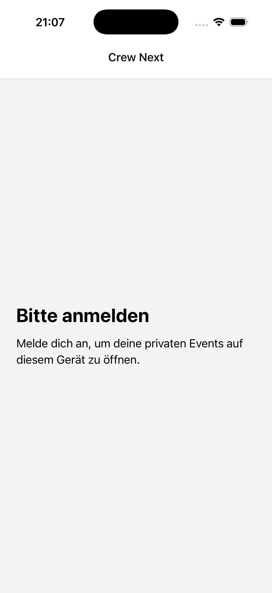
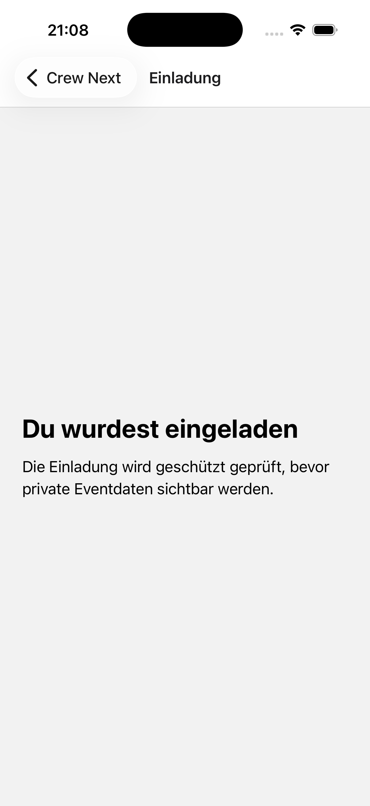
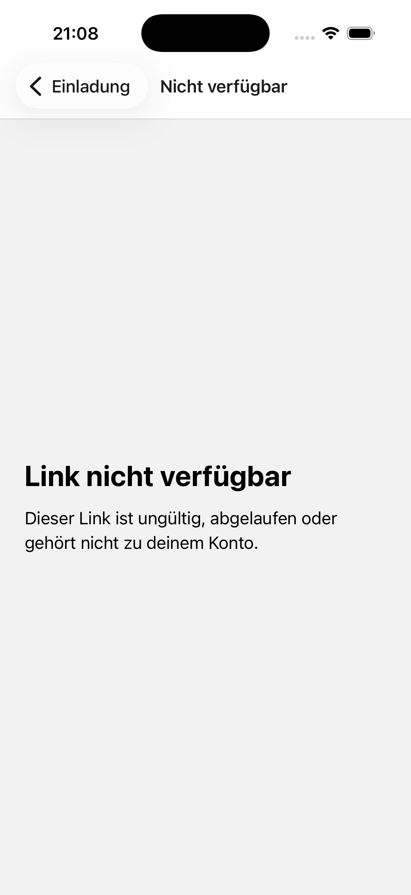
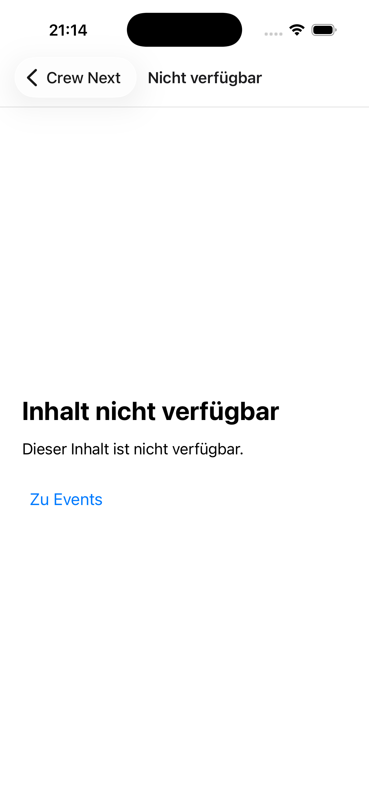
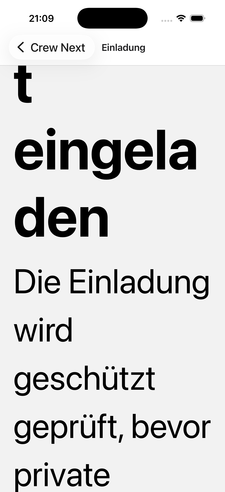
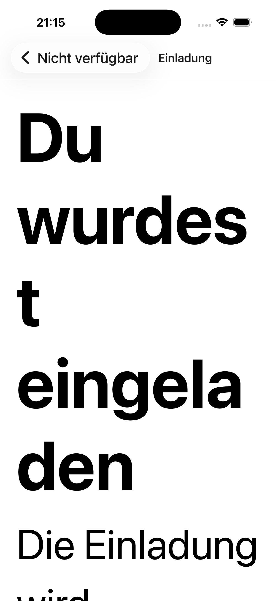
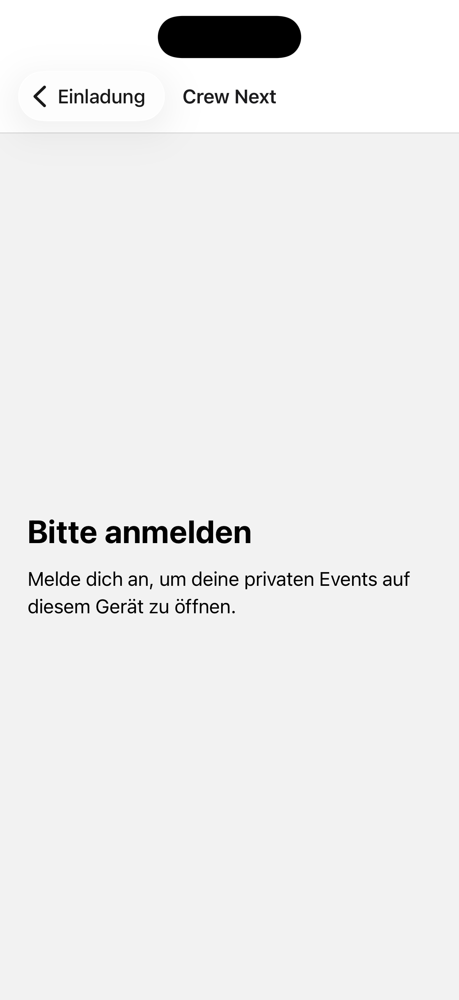
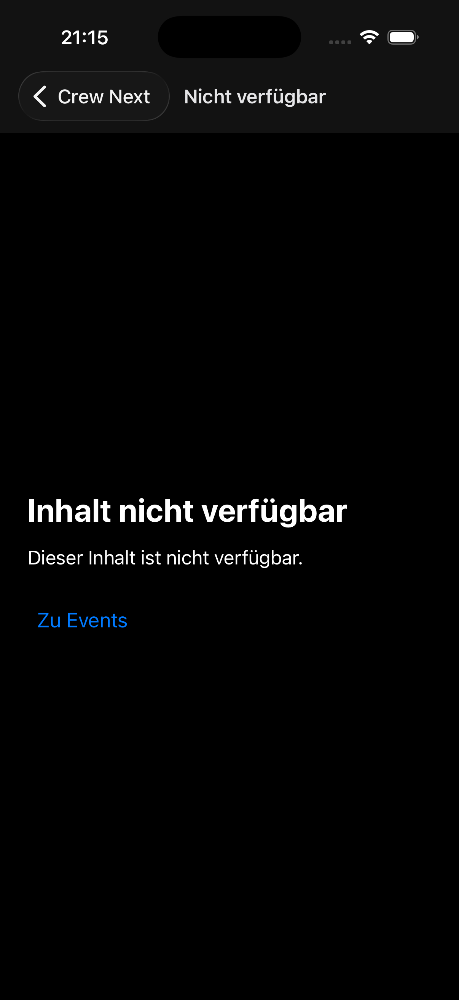

# Crew Next native shell UX and accessibility audit

- Bead: `crew-paq.4.9`
- Date: 2026-07-18
- Surface: current React Native shell on iPhone 17 Pro simulator, iOS 26.2
- Mode: direction-neutral combined UX/accessibility audit
- User goal: enter Crew, follow an invite or private event link, and recover
  safely when access is unavailable
- Accessibility target: readable and recoverable at iOS accessibility text
  sizes, system-appearance support, semantic heading/action order, and
  concealment-safe copy

## Numbered flow

### 1. Cold signed-out entry — blocked

The screen clearly states that sign-in is required and exposes no private data.
It has no sign-in action, so the user cannot continue. This is the already-open
P0 scope of `crew-paq.3.5`, not something to disguise with a non-functional
shell button.

### 2. Valid invite deep link — blocked

Opaque-handle routing keeps the token out of the visible route, and the screen
delays private data. It does not fetch a safe preview or offer identity/redeem
actions, so the invited user cannot proceed. Ownership remains
`crew-paq.3.5`.

### 3. Identity redemption and private-target return — named blocker

The captured magic-link and private-event routes were placeholders with no
completion, recovery, or sign-in-and-return behavior. Their screenshots are
intentionally omitted from this bounded representative set. Both gaps remain
owned by `crew-paq.3.5`; no event-specific data was exposed while signed out.

### 4. Invalid or concealed target — healthy after fix

Before:

After:

The old catch-all speculated that a link was invalid, expired, or tied to
another account. The fixed screen uses the authorized generic fallback,
confirms no protected detail, and provides one deterministic `Zu Events`
recovery action.

### 5. Accessibility text size — structurally healthy after fix

Before:

After:

At `accessibility-extra-extra-extra-large`, the fixed-size centered container
clipped the invite heading and description. The shared frame is now a scroll
container with a growing content area, so the first content remains present
and later content/actions remain reachable by scrolling without capping
Dynamic Type.

### 6. Dark appearance — healthy after fix

Before:

After:

The app previously selected a light status-bar style in dark system appearance
while retaining a light navigation surface, making status icons disappear.
Navigation and shell content now use matching system light/dark themes and
high-contrast neutral text/background colors.

## Strengths

- Invite and auth secrets are converted to opaque handles before navigation.
- Private routes render no event-specific data while signed out.
- Shared screen headings expose `accessibilityRole="header"`.
- Default text scaling remains enabled; the fix adds scrolling instead of
  capping font growth.
- The recovery action is a native button with a clear visible and accessible
  name.

## UX risks

- Sign-in, invite preview/redeem, and signed-out return are placeholders, so
  every meaningful entry path is currently blocked. This is an explicit P0
  product gap owned by `crew-paq.3.5` and keeps `[P-MOBILE]` closed.
- Warm deep links accumulate native back-stack labels from the previous route.
  Final auth/invite implementation must define replace-versus-push semantics
  and restore the exact pending target after authentication.
- Current placeholder copy describes implementation/security mechanics more
  than the next user action. Replace it within the owned auth/invite flow, not
  in this shell audit.

## Accessibility risks and evidence limits

- VoiceOver focus landing, announcement timing, rotor order, and native button
  activation were not verified with an assistive-technology session.
- Android/TalkBack and Android font-scaling evidence is absent because `adb`
  was unavailable in this environment.
- Scroll reachability is supported by the rendered scroll container and source
  test, but a physical swipe at AX5 was not automated in this run.
- No numeric color-contrast or Switch Control test was performed. The current
  black/white shell contrast is visually strong; final semantic colors still
  need token-level verification.

## Verification

- Fresh iOS screenshots inspected at normal text, AX5, light mode, and dark
  mode.
- `bun run check:mobile-app`: ESLint PASS, TypeScript PASS, Jest 10 suites / 25
  tests PASS.
- Simulator settings restored to `large` text and `light` appearance.
- No backend, visual direction, commit, push, or deploy.

## Recommendation

Keep `crew-paq.4.9` limited to the shared structural fixes above. The next
release-critical implementation is `crew-paq.3.5`: safe invite preview, email
identity, atomic redemption, exact pending-route return, and event switching
with real Gateway evidence.
