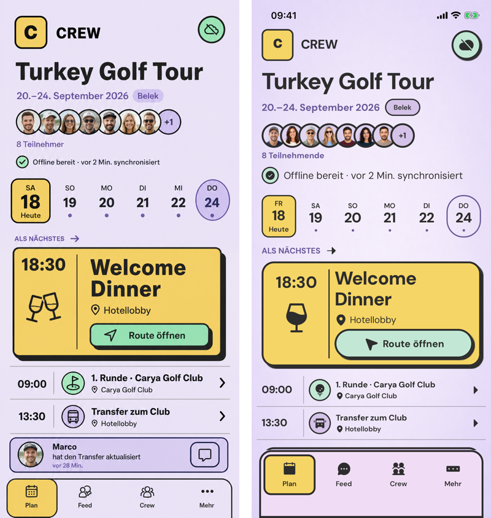
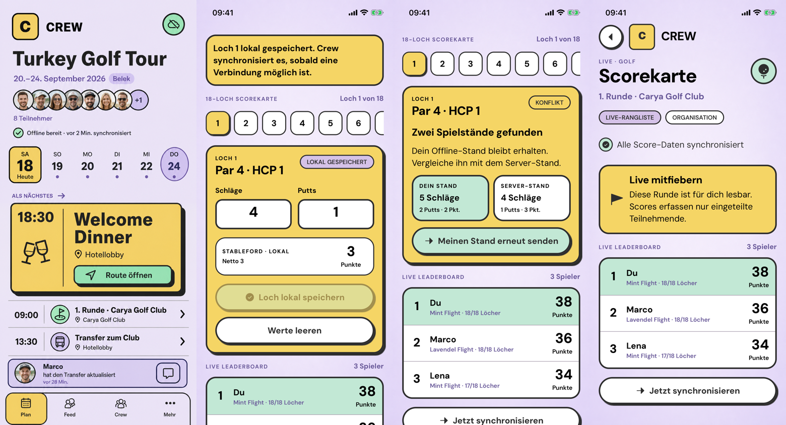
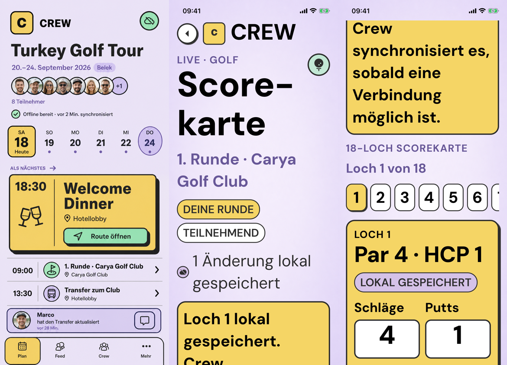
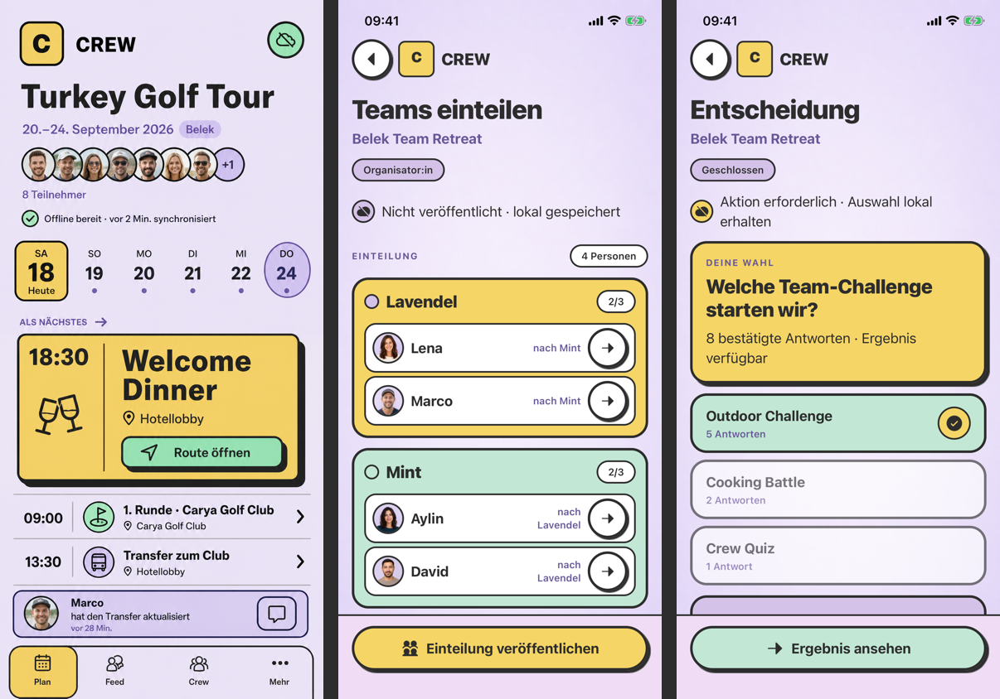
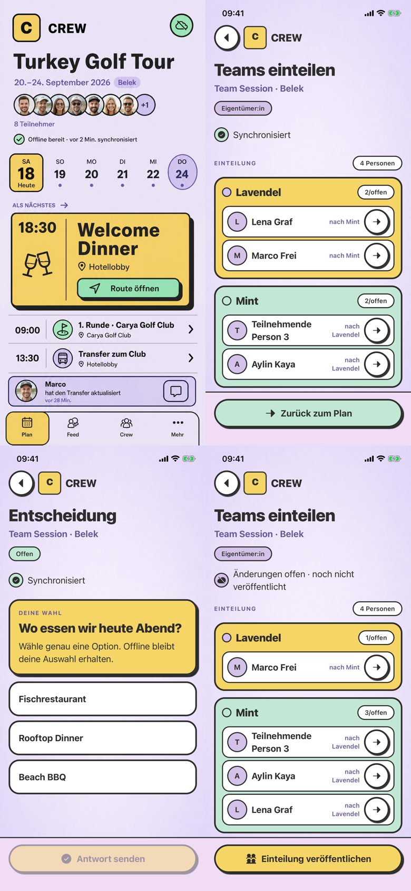
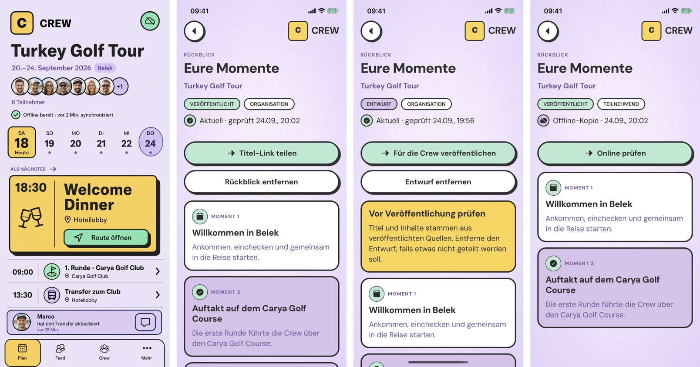
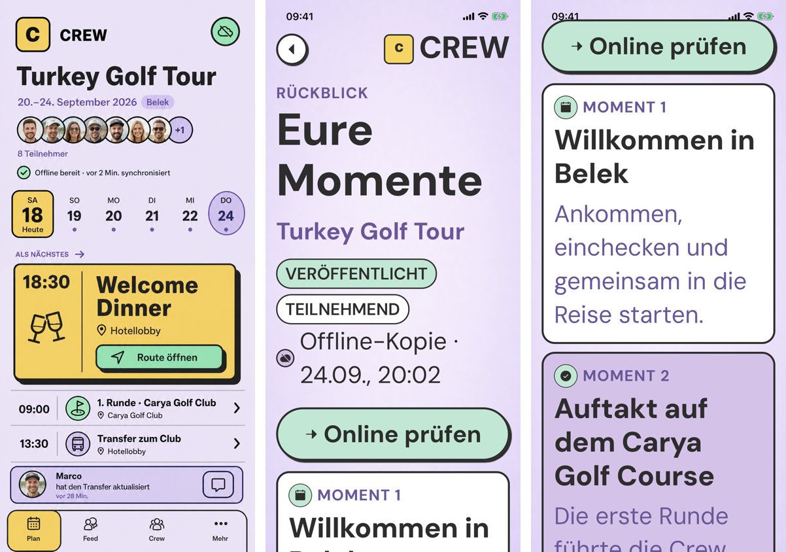

# Persistent evidence and asset provenance

All linked screen evidence lives inside the repository. Use each 390 x 844 file
at 100% scale in Figma and lock it. The full-resolution files exist for pixel
inspection, not as alternate artboards.

## Event Hub evidence

| Evidence ID                 | Persistent file                                                                                                            | State and proof boundary                                                                                   |
| --------------------------- | -------------------------------------------------------------------------------------------------------------------------- | ---------------------------------------------------------------------------------------------------------- |
| `EVID-EH-REFERENCE`         | [Option 2 reference, 390 x 844](../../../apps/mobile/evidence/event-hub-option-2/reference-390x844.png)                    | Selected Crew Board visual source; not runtime proof                                                       |
| `EVID-EH-PARTICIPANT-READY` | [Final unscrolled Event Hub, 390 x 844](../../../apps/mobile/evidence/event-hub-option-2/01-final-unscrolled-390x844.png)  | `SCR-004`, participant, offline-ready/synced baseline, current native routed view                          |
| `EVID-EH-PARTICIPANT-FEED`  | [Short-scroll feed state, 390 x 844](../../../apps/mobile/evidence/event-hub-option-2/02-final-feed-390x844.png)           | Same fixture after a short scroll; proves feed update and fixed navigation, not a different entry position |
| `EVID-EH-COMPARE`           | [Reference vs implementation](../../../apps/mobile/evidence/event-hub-option-2/comparison-reference-vs-implementation.png) | Reference left, implementation right; final visual comparison                                              |
| `EVID-EH-QA`                | [Design QA](../../../design-qa.md)                                                                                         | Corrections, verification, remaining P3 differences, final pass                                            |



The implementation intentionally uses the real September 2026 weekday/date
mapping and production-safe system chrome. The feed update is below the first
fold so the bottom navigation stays tappable; the feed evidence proves it after
scrolling.

## Event publish review code evidence

`SCR-013` now has a production-routed Option-2 implementation from the private
Event Hub at `events/:rootEventId/review`. The code and automated tests cover an
account/root-scoped cached participant preview, owner/organizer gating,
authoritative readiness, online-only publication, unresolved-outbox blocking,
exact idempotency replay after a lost response, attempted/current conflict
truth, enqueue-versus-publish exclusion, account switching, and a confirmed
publish whose follow-up refresh is still pending.

Title, description, start, and end blockers now open the production
`EventBasicsEdit` route for the existing private draft. Source and focused/full
automated tests cover account/root/manager gates, exact optimistic-overlay
restart, one cross-runtime mutation lock, honest queued/synced/conflict states,
current-version conflict replacement, DST gap/fold validation, stale-action
rejection, and authoritative readiness refetch on return.

This section is intentionally source-and-test evidence only. There is no
`EVID-*` screenshot for `SCR-013` yet, and it does not claim native iOS/Android
rendering, a real service-backed publish journey, or implemented setup/place
editor actions for every readiness blocker. Offline review has no publish/sync
action and never claims a queued command.

The current narrow `EventSetupRecovery` source and automated tests also cover
the zero-result place branch: first-party empty result, explicit worldwide
disclosure and country, caller-stable `search_miss` creation, bounded polling,
strict cited-field projection, and idempotent owner/organizer approve or
reject. Approval alone produces a reviewed candidate and then reuses the
existing event-place creation plus capability bind; rejection creates and
binds nothing. Typed terminal/provider failures retain the query and country,
remove stale review actions, and never expose prompts, model data, secrets, or
uncited fields.

That is source-and-test provenance, not a new `EVID-*` asset. Fresh native
screenshots and visual parity, distribution-signed physical devices,
VoiceOver/TalkBack, a provider-enabled live worker, production, and an external
Figma update remain unproven.

## Events and switching evidence

| Evidence ID                 | Persistent file                                                                                                                                | State and proof boundary                                                                                  |
| --------------------------- | ---------------------------------------------------------------------------------------------------------------------------------------------- | --------------------------------------------------------------------------------------------------------- |
| `EVID-EVENTS-READY`         | [Actor roots, 390 x 844](../../../apps/mobile/evidence/events-option-2/01-events-ready-390x844.png)                                            | `SCR-003`, multiple authorized roots, duplicated human-facing names allowed; current routed Option-2 view |
| `EVID-EVENTS-LARGE`         | [Actor roots at 200% text, 390 x 844](../../../apps/mobile/evidence/events-option-2/02-events-accessibility-large-390x844.png)                 | Compact accessibility frame; titles, roles, sync state, and primary actions remain reachable              |
| `EVID-EVENTS-OFFLINE`       | [Durable actor index, 390 x 844](../../../apps/mobile/evidence/events-option-2/03-events-offline-390x844.png)                                  | Cached-first, account-scoped root index with visible refresh time and functional refresh                  |
| `EVID-EVENTS-OFFLINE-LARGE` | [Durable actor index at 200% text, 390 x 844](../../../apps/mobile/evidence/events-option-2/04-events-offline-accessibility-large-390x844.png) | Offline state remains vertically scrollable without horizontal clipping                                   |
| `EVID-EVENTS-COMPARE`       | [Option 2 source and Events](../../../apps/mobile/evidence/events-option-2/comparison-source-vs-events.png)                                    | Binding source and Events state in one same-viewport comparison                                           |
| `EVID-EVENTS-QA`            | [Events design QA](../../../apps/mobile/evidence/events-option-2/design-qa.md)                                                                 | Historical visual review; current approval boundary is stated in the QA record                            |

## Auth, invite, and safe recovery evidence

| Evidence ID                | Persistent file                                                                                                                                                       | State and proof boundary                                                                              |
| -------------------------- | --------------------------------------------------------------------------------------------------------------------------------------------------------------------- | ----------------------------------------------------------------------------------------------------- |
| `EVID-AUTH-SIGN-IN`        | [Accepted sign-in request, 390 x 844](../../../apps/mobile/evidence/auth-option-2/01-sign-in-accepted-390x844.png)                                                    | Production controller, neutral accepted state, passwordless copy, functional resend                   |
| `EVID-AUTH-IDENTITY`       | [Expired identity link, 390 x 844](../../../apps/mobile/evidence/auth-option-2/02-identity-expired-390x844.png)                                                       | Invalid/expired is visually distinct from transport outage and opens no private data                  |
| `EVID-AUTH-INVITE`         | [Signed-out invite, 390 x 844](../../../apps/mobile/evidence/auth-option-2/03-invite-signed-out-390x844.png)                                                          | Sanitized invitation preview with role and public title only                                          |
| `EVID-AUTH-MISMATCH`       | [Invite account mismatch, 390 x 844](../../../apps/mobile/evidence/auth-option-2/04-invite-account-mismatch-390x844.png)                                              | No membership is created; safe account-switch recovery                                                |
| `EVID-AUTH-PRIVATE`        | [Private access unavailable, 390 x 844](../../../apps/mobile/evidence/auth-option-2/05-private-unavailable-390x844.png)                                               | Fail-closed private bootstrap recovery; protected data stays concealed                                |
| `EVID-AUTH-RECOVERY`       | [Retryable inbound check, 390 x 844](../../../apps/mobile/evidence/auth-option-2/06-inbound-retryable-390x844.png)                                                    | Reload-only recovery; protected target stays concealed                                                |
| `EVID-AUTH-UNAVAILABLE`    | [Generic unavailable target, 390 x 844](../../../apps/mobile/evidence/auth-option-2/07-unavailable-390x844.png)                                                       | Missing and denied targets remain indistinguishable; existing Events return remains operable          |
| `EVID-AUTH-LARGE`          | [Invite at 200% text, 390 x 844](../../../apps/mobile/evidence/auth-option-2/08-invite-long-text-accessibility-large-390x844.png)                                     | Long bilingual-style content remains scrollable with no horizontal clipping                           |
| `EVID-AUTH-XL-TOP`         | [Unavailable at Accessibility Extra Large, top](../../../apps/mobile/evidence/auth-option-2/09-unavailable-accessibility-extra-large-top-390x844.png)                 | Complete extra-large top hierarchy and concealed target copy without horizontal clipping              |
| `EVID-AUTH-XL-ACTION`      | [Unavailable at Accessibility Extra Large, scrolled action](../../../apps/mobile/evidence/auth-option-2/10-unavailable-accessibility-extra-large-actions-390x844.png) | Real native scroll reaches the existing `Zu Events` action                                            |
| `EVID-AUTH-COMPARE-ENTRY`  | [Source, sign-in, identity, invite, mismatch](../../../apps/mobile/evidence/auth-option-2/comparison-reference-vs-entry-auth-invite.png)                              | One same-input visual comparison for entry and invitation states                                      |
| `EVID-AUTH-COMPARE-ACCESS` | [Source and access/recovery states](../../../apps/mobile/evidence/auth-option-2/comparison-reference-vs-access-recovery.png)                                          | One same-input visual comparison for concealed private, retryable, unavailable, and large-text states |
| `EVID-AUTH-COMPARE-XL`     | [Source and unavailable normal/extra-large states](../../../apps/mobile/evidence/auth-option-2/comparison-reference-vs-unavailable-accessibility-extra-large.png)     | Same-input comparison for normal unavailable plus extra-large top and real-scrolled action            |
| `EVID-AUTH-QA`             | [Auth design QA](../../../apps/mobile/evidence/auth-option-2/design-qa.md)                                                                                            | Current iOS visual P0/P1/P2 result and explicit external Android boundary                             |

The auth set above is current iOS simulator evidence captured on 2026-07-26.
Its Large and Extra Large states preserve the shared uncapped base typography
tokens and use native wrapping plus the existing vertical scroll path; no
uniform 2x cap is claimed.
It does not claim current Android rendering, physical-device acceptance, or a
store-distributed build; those remain external release inputs.

## Native invite manager and editor evidence

| Evidence ID                   | Persistent file                                                                                                                                                                                                                                                                                                                                     | State and proof boundary                                                                                                           |
| ----------------------------- | --------------------------------------------------------------------------------------------------------------------------------------------------------------------------------------------------------------------------------------------------------------------------------------------------------------------------------------------------- | ---------------------------------------------------------------------------------------------------------------------------------- |
| `EVID-INVITE-IOS-MANAGER`     | [Owner manager after create](../../../apps/mobile/evidence/native-invite-manager-2026-07-27/runtime/logical/ios-owner-manager-after-create.png) and [at Accessibility Extra Large](../../../apps/mobile/evidence/native-invite-manager-2026-07-27/runtime/logical/ios-owner-manager-large-text.png)                                                 | `SCR-020`; immediate refreshed invitation summary and reachable owner manager at Large Text; iOS simulator only                    |
| `EVID-INVITE-IOS-EDITOR`      | [Owner editor after native picker round trip](../../../apps/mobile/evidence/native-invite-manager-2026-07-27/runtime/logical/ios-owner-editor-picker-roundtrip.png)                                                                                                                                                                                 | `SCR-021`; owner role matrix and returned local date/time/time-zone value after native picker confirmation; iOS simulator only     |
| `EVID-INVITE-ANDROID-MANAGER` | [Organizer manager at font scale 2.0](../../../apps/mobile/evidence/native-invite-manager-2026-07-27/runtime/logical/android-organizer-manager-font-2.png)                                                                                                                                                                                          | `SCR-020`; organizer manager remains reachable with current summaries and create action; Android emulator only                     |
| `EVID-INVITE-ANDROID-EDITOR`  | [Organizer role region at font scale 2.0](../../../apps/mobile/evidence/native-invite-manager-2026-07-27/runtime/logical/android-organizer-editor-role-region-font-2.png) and [editor after native picker round trip](../../../apps/mobile/evidence/native-invite-manager-2026-07-27/runtime/logical/android-organizer-editor-picker-roundtrip.png) | `SCR-021`; organizer choice is absent, intended role remains selected, and local expiry returns from native dialogs; emulator only |

The current sanitized packet under
`apps/mobile/evidence/native-invite-manager-2026-07-27` contains five Maestro
definitions across seven zero-failure runs. It covers iOS owner and Android
organizer role behavior, native picker cancel/confirm, create plus immediate
manager refresh, iOS Accessibility Extra Large, and Android
`font_scale=2.0`; retained screenshots contain no invitation token. It uses
isolated local services and does not claim a production backend,
distribution-signed physical devices, physical 200% text, VoiceOver/TalkBack,
native DST-overlap selection, share-sheet cancellation, or an updated external
Figma file.

## Golf scorecard evidence

| Evidence ID                | Persistent file                                                                                                                                                                                                        | State and proof boundary                                                                                                |
| -------------------------- | ---------------------------------------------------------------------------------------------------------------------------------------------------------------------------------------------------------------------- | ----------------------------------------------------------------------------------------------------------------------- |
| `EVID-GOLF-QUEUED-TOP`     | [Participant queued top, 390 x 844](../../../apps/mobile/evidence/golf-scorecard-option-2/01-participant-queued-top-390x844.png)                                                                                       | Routed participant, honest local-pending state, role, round and offline message                                         |
| `EVID-GOLF-QUEUED-EDITOR`  | [Participant queued editor, 390 x 844](../../../apps/mobile/evidence/golf-scorecard-option-2/02-participant-queued-editor-390x844.png)                                                                                 | Real-scroll state with 18-hole rail, selected-hole inputs, local Stableford, save/clear actions and leaderboard start   |
| `EVID-GOLF-CONFLICT`       | [Complete conflict, 390 x 844](../../../apps/mobile/evidence/golf-scorecard-option-2/03-conflict-resolution-390x844.png)                                                                                               | Both local and server values remain visible; explicit resend creates a fresh durable replacement                        |
| `EVID-GOLF-READ-ONLY`      | [Organizer read-only leaderboard, 390 x 844](../../../apps/mobile/evidence/golf-scorecard-option-2/04-read-only-leaderboard-390x844.png)                                                                               | Organizer/non-player/viewer path has ranking and sync, but no score inputs or write action                              |
| `EVID-GOLF-LARGE-TOP`      | [Participant at Accessibility Large, 390 x 844](../../../apps/mobile/evidence/golf-scorecard-option-2/05-participant-accessibility-large-top-390x844.png)                                                              | Near-200% type, semantic `Score-` / `karte` wrapping and complete top hierarchy without horizontal clipping             |
| `EVID-GOLF-LARGE-SCROLLED` | [Accessibility Large after real scroll, 390 x 844](../../../apps/mobile/evidence/golf-scorecard-option-2/06-participant-accessibility-large-scrolled-390x844.png)                                                      | Three native swipes reach the hole rail and editable values while the scroll viewport remains below the iOS status area |
| `EVID-GOLF-COMPARE`        | [Source and normal Golf states](../../../apps/mobile/evidence/golf-scorecard-option-2/comparison-normal-1x.png)                                                                                                        | Binding source plus queued editor, conflict and read-only states; every panel is 390 x 844 at 1:1                       |
| `EVID-GOLF-COMPARE-LARGE`  | [Source and large-text Golf states](../../../apps/mobile/evidence/golf-scorecard-option-2/comparison-accessibility-large-1x.png)                                                                                       | Binding source plus top and scrolled Accessibility Large states; every panel is 390 x 844 at 1:1                        |
| `EVID-GOLF-INTERACTION`    | [Normal scroll Maestro path](../../../apps/mobile/evidence/golf-scorecard-option-2/maestro-scroll.yaml) and [large-text path](../../../apps/mobile/evidence/golf-scorecard-option-2/maestro-scroll-accessibility.yaml) | Passing iPhone 16e assertions and native swipes used for the persisted editor evidence                                  |
| `EVID-GOLF-QA`             | [Golf design QA](../../../apps/mobile/evidence/golf-scorecard-option-2/design-qa.md)                                                                                                                                   | Same-input Option-2 comparison, safe-area and large-title correction history, state truth and final P0/P1/P2 pass       |





The production `GolfScorecard` route composes the signed-in actor role, active
root and selected round into `GolfScorecardRuntime`. It reads and writes only
through the existing account/root `GolfOfflineStore` and one
`MobileSyncEngine`. Eligible participants receive exactly 18 ordered holes,
local Stableford preview, stable replay identity across restart, durable
set/clear overlay semantics and a fresh queued replacement after conflict.
Owner, organizer, viewer and ineligible participant roles are read-only.

These iOS captures use an isolated Release bundle and deterministic evidence
entry. By themselves they prove rendered queued, conflict, read-only and
large-text states, not a deployed backend or Android visual parity. The
[closed local Turkey Golf journey][evid-turkey-golf-closure]
subsequently added retained iOS/Android offline replay plus service-backed
convergence for `crew-paq.7.4`. It still does not claim a same-state Android
visual comparison, distribution-signed physical devices, or production.

## Team collaboration evidence

| Evidence ID                     | Persistent file                                                                                                                                               | State and proof boundary                                                                                                                                                                          |
| ------------------------------- | ------------------------------------------------------------------------------------------------------------------------------------------------------------- | ------------------------------------------------------------------------------------------------------------------------------------------------------------------------------------------------- |
| `EVID-TEAM-ORGANIZER-LOCAL`     | [Organizer assignments, 390 x 844](../../../apps/mobile/evidence/team-collaboration-option-2/01-organizer-assignments-390x844.png)                            | `SCR-032`, organizer, local unpublished assignment, one publish action; current native view and iOS visual evidence                                                                               |
| `EVID-TEAM-ORGANIZER-LOCAL-3X`  | [Organizer assignments, 1170 x 2532](../../../apps/mobile/evidence/team-collaboration-option-2/01-organizer-assignments-1170x2532.png)                        | Exact 3x physical capture behind the normalized 390 x 844 organizer evidence; pixel inspection only                                                                                               |
| `EVID-TEAM-PARTICIPANT-CLOSED`  | [Participant closed-attention decision, 390 x 844](../../../apps/mobile/evidence/team-collaboration-option-2/02-participant-closed-attention-390x844.png)     | `SCR-033`, participant, server decision closed during outage, local choice retained, needs attention; current native view and iOS visual evidence                                                 |
| `EVID-TEAM-PARTICIPANT-3X`      | [Participant closed-attention decision, 1170 x 2532](../../../apps/mobile/evidence/team-collaboration-option-2/02-participant-closed-attention-1170x2532.png) | Exact 3x physical capture behind the normalized 390 x 844 participant evidence; pixel inspection only                                                                                             |
| `EVID-TEAM-COMPARE`             | [Option 2 source and both Team views](../../../apps/mobile/evidence/team-collaboration-option-2/comparison-source-vs-team-views.png)                          | One horizontal comparison: source, organizer, participant                                                                                                                                         |
| `EVID-TEAM-QA`                  | [Team design QA](../../../apps/mobile/evidence/team-collaboration-option-2/design-qa.md)                                                                      | Historical cross-state review; current same-state approval remains unclaimed                                                                                                                      |
| `EVID-TEAM-PRODUCTION-SETUP`    | [Production Team setup, 390 x 844](../../../apps/mobile/evidence/team-production-routes/01-team-setup-production-390x844.png)                                 | Routed owner/organizer view backed by account/root SQLCipher projections and sanitized member directory                                                                                           |
| `EVID-TEAM-PRODUCTION-DECISION` | [Production Decision, 390 x 844](../../../apps/mobile/evidence/team-production-routes/02-decision-production-390x844.png)                                     | Routed participant decision with role guard, no initial selection, and honest disabled action                                                                                                     |
| `EVID-TEAM-PRODUCTION-DRAFT`    | [Production unpublished draft, 390 x 844](../../../apps/mobile/evidence/team-production-routes/03-team-draft-production-390x844.png)                          | A real move produces `Änderungen offen · noch nicht veröffentlicht`; publish remains an explicit separate action                                                                                  |
| `EVID-TEAM-PRODUCTION-COMPARE`  | [Source and three production Team states](../../../apps/mobile/evidence/team-production-routes/comparison-reference-vs-production-team.png)                   | Binding source, setup, Decision, and draft in one 2 x 2 same-viewport comparison                                                                                                                  |
| `EVID-TEAM-PRODUCTION-QA`       | [Production Team design QA](../../../apps/mobile/evidence/team-production-routes/design-qa.md)                                                                | Historical native interaction provenance; current visual approval remains unclaimed                                                                                                               |
| `EVID-TEAM-MAESTRO-SETUP`       | [Assignment Maestro path](../../../apps/mobile/evidence/team-production-routes/maestro-assignment-draft.yaml)                                                 | Passing iPhone 16e interaction path: open setup, move by stable identity, assert honest draft/publish state                                                                                       |
| `EVID-TEAM-MAESTRO-DECISION`    | [Decision Maestro path](../../../apps/mobile/evidence/team-production-routes/maestro-decision.yaml)                                                           | Passing iPhone 16e accessibility path through production navigation into Decision                                                                                                                 |
| `EVID-TEAM-VERTICAL-FINAL`      | [Final coherent Team/Feedback native packet][evid-team-vertical-final]                                                                                        | Closed `crew-paq.8.3`: one isolated local iOS-simulator/Android-emulator Team journey, 21/21 JUnit cases, 22 execution screenshots, 8 sanitized traces, 4 oracles, and 75/75 retained-file hashes |





The 1170 x 2532 and normalized 390 x 844 pairs use the same iPhone 16e viewport
as the Event Hub evidence. The older 1206 x 2622 derivatives are superseded and
are not handoff evidence. The production set proves routed Team setup and
Decision, account/root SQLCipher names, a stable-ID move, an honest unpublished
state, and a passing iOS Maestro accessibility path. The later final packet
adds iOS owner Plan, Live, editor, Crew and feed readback plus Android
participant Crew, offline feed replay/convergence, feedback capture/delivery,
cold list readback and logout in one isolated local session. It is execution
and provenance evidence, not a same-input visual comparison or a fresh design
approval. Generic conflict resolution, every `ST-SCR-032/033` state, same-state
Android parity, distribution-signed physical devices, VoiceOver/TalkBack,
external Figma and production remain unproven.

[evid-turkey-golf-closure]: ../../../apps/mobile/evidence/turkey-golf-vertical-closure/README.md
[evid-team-vertical-final]: ../../../apps/mobile/evidence/team-vertical-session-2026-07-27-final/README.md

## Recap evidence

| Evidence ID                  | Persistent file                                                                                                                                                  | State and proof boundary                                                                                          |
| ---------------------------- | ---------------------------------------------------------------------------------------------------------------------------------------------------------------- | ----------------------------------------------------------------------------------------------------------------- |
| `EVID-RECAP-MANAGER-PUBLISH` | [Organizer published, 390 x 844](../../../apps/mobile/evidence/recap-option-2/01-organizer-published-390x844.png)                                                | Routed owner/organizer reviewed published version with explicit title-only share and remove controls              |
| `EVID-RECAP-MANAGER-DRAFT`   | [Organizer draft, 390 x 844](../../../apps/mobile/evidence/recap-option-2/02-organizer-draft-390x844.png)                                                        | Generated draft review with online-only publish/remove behavior; it does not claim manual highlight editing       |
| `EVID-RECAP-MEMBER-OFFLINE`  | [Participant published offline, 390 x 844](../../../apps/mobile/evidence/recap-option-2/03-participant-offline-390x844.png)                                      | Authorized account/root SQLite snapshot, published-only participant view, and honest online retry                 |
| `EVID-RECAP-LARGE`           | [Participant offline at Accessibility Large, 390 x 844](../../../apps/mobile/evidence/recap-option-2/04-participant-offline-accessibility-large-390x844.png)     | Near-200% type with the complete primary action reachable and no horizontal clipping                              |
| `EVID-RECAP-LARGE-SCROLLED`  | [Accessibility Large after real scroll, 390 x 844](../../../apps/mobile/evidence/recap-option-2/05-participant-offline-accessibility-large-scrolled-390x844.png) | Direct simulator interaction proves both moment cards remain vertically reachable                                 |
| `EVID-RECAP-COMPARE`         | [Source and normal Recap states](../../../apps/mobile/evidence/recap-option-2/comparison-reference-vs-recap.png)                                                 | Binding source plus manager published, manager draft, and participant offline states in one same-input comparison |
| `EVID-RECAP-COMPARE-LARGE`   | [Source and large-text Recap states](../../../apps/mobile/evidence/recap-option-2/comparison-reference-vs-recap-accessibility.png)                               | Binding source plus top and scrolled large-text states in one same-input comparison                               |
| `EVID-RECAP-QA`              | [Recap design QA](../../../apps/mobile/evidence/recap-option-2/design-qa.md)                                                                                     | Final P0/P1/P2 review, privacy and token-persistence boundary, accessibility correction history, and validation   |





The production `RecapInbound` route composes roles from the active private
session and account/root-scoped SQLite state. Owner and organizer operations
use only generated Gateway-client methods and require a confirmed online
response; no recap mutation is placed in the mobile Outbox. Participants and
viewers receive published snapshots only. Denial, removal, malformed content,
account switch, and requested-version drift purge or conceal stale protected
content. A successful seven-day share token exists only in the controller
response and current React state long enough to invoke the native share sheet;
it is never persisted in SQLite, navigation, diagnostics, or the Outbox.

This evidence does not claim manual recap editing, participant-created links,
a cached public projection, a deployed public consumer, Android visual parity,
or a real service-backed recovery journey on both platforms.

## Native runtime and encrypted-data evidence

| Evidence ID            | Persistent file                                                                                                        | State and proof boundary                                                                                              |
| ---------------------- | ---------------------------------------------------------------------------------------------------------------------- | --------------------------------------------------------------------------------------------------------------------- |
| `EVID-NATIVE-ANDROID`  | [Android SQLCipher/Keychain probe, 412 x 915](../../evidence/android-native-scaffold/01-native-data-probe-412x915.png) | API-36 ARM64 native runtime: Hermes/Fabric, 14 migrations, restart, wrong-key rejection, rollback, exclusive ordering |
| `EVID-NATIVE-IOS`      | [iOS SQLCipher/Keychain probe, 402 x 874](../../evidence/ios-native-scaffold/01-native-data-probe-402x874.png)         | iOS 26.2 ARM64 native runtime with the same production data path and assertions                                       |
| `EVID-NATIVE-BOUNDARY` | [Native scaffold evidence](../../evidence/native-mobile-scaffold.md)                                                   | Commands, checksums, product identity, deep-link proof, and explicit remaining release boundaries                     |

These probes prove the native scaffold and encrypted data boundary, not a
visual Android product-screen comparison. `A-AND` product states still require
their own same-state comparison evidence before Android visual parity is
claimed. The final Team packet's Android execution captures do not replace that
comparison.

## Native source and test links

| Surface                  | Source                                                                                                                                                                                                                                                                                                                                                                                                              | Automated evidence                                                                                                                                                                                                                                                                                                                                                                                                                                                                                                                                                                                                                                                                                                                                           |
| ------------------------ | ------------------------------------------------------------------------------------------------------------------------------------------------------------------------------------------------------------------------------------------------------------------------------------------------------------------------------------------------------------------------------------------------------------------- | ------------------------------------------------------------------------------------------------------------------------------------------------------------------------------------------------------------------------------------------------------------------------------------------------------------------------------------------------------------------------------------------------------------------------------------------------------------------------------------------------------------------------------------------------------------------------------------------------------------------------------------------------------------------------------------------------------------------------------------------------------------ |
| Events / switching       | [EventsScreen.tsx](../../../apps/mobile/src/screens/EventsScreen.tsx), [actorEventRootIndex.ts](../../../packages/mobile-data/src/actorEventRootIndex.ts)                                                                                                                                                                                                                                                           | [EventsScreen.test.tsx](../../../apps/mobile/__tests__/EventsScreen.test.tsx), [actor-event-root-index.test.ts](../../../packages/mobile-data/test/actor-event-root-index.test.ts), restart, pagination, denial purge, account-switch, and duplicate-title flows                                                                                                                                                                                                                                                                                                                                                                                                                                                                                             |
| Event Hub                | [EventHubScreen.tsx](../../../apps/mobile/src/screens/EventHubScreen.tsx), [EventHubView.tsx](../../../apps/mobile/src/screens/EventHubView.tsx)                                                                                                                                                                                                                                                                    | [EventHubScreen.test.tsx](../../../apps/mobile/__tests__/EventHubScreen.test.tsx), [EventHubView.test.tsx](../../../apps/mobile/__tests__/EventHubView.test.tsx)                                                                                                                                                                                                                                                                                                                                                                                                                                                                                                                                                                                             |
| Plan and Live            | [PlanScreen.tsx](../../../apps/mobile/src/screens/PlanScreen.tsx), [PlanRuntime.ts](../../../apps/mobile/src/screens/PlanRuntime.ts), [LiveItemScreen.tsx](../../../apps/mobile/src/screens/LiveItemScreen.tsx)                                                                                                                                                                                                     | [PlanRuntime.test.ts](../../../apps/mobile/__tests__/PlanRuntime.test.ts), [PlanViews.test.tsx](../../../apps/mobile/__tests__/PlanViews.test.tsx), [LiveItemScreen.test.ts](../../../apps/mobile/__tests__/LiveItemScreen.test.ts); child-event and itinerary authoring/reorder are code/test current, and the final Team packet retains iOS Plan/Live execution captures. Same-state Android parity and physical-device evidence remain pending.                                                                                                                                                                                                                                                                                                           |
| Event publish review     | [EventPublishScreen.tsx](../../../apps/mobile/src/screens/EventPublishScreen.tsx), [EventPublishView.tsx](../../../apps/mobile/src/screens/EventPublishView.tsx), [EventPublishRuntime.ts](../../../apps/mobile/src/screens/EventPublishRuntime.ts), [eventPublish.ts](../../../packages/mobile-data/src/eventPublish.ts)                                                                                           | [EventPublishScreen.test.tsx](../../../apps/mobile/__tests__/EventPublishScreen.test.tsx), [EventPublishView.test.tsx](../../../apps/mobile/__tests__/EventPublishView.test.tsx), [EventPublishRuntime.test.ts](../../../apps/mobile/__tests__/EventPublishRuntime.test.ts), [event-publish.test.ts](../../../packages/mobile-data/test/event-publish.test.ts)                                                                                                                                                                                                                                                                                                                                                                                               |
| Publish setup recovery   | [EventSetupRecoveryScreen.tsx](../../../apps/mobile/src/screens/EventSetupRecoveryScreen.tsx), [EventSetupRecoveryView.tsx](../../../apps/mobile/src/screens/EventSetupRecoveryView.tsx), [EventSetupRecoveryRuntime.ts](../../../apps/mobile/src/screens/EventSetupRecoveryRuntime.ts), [place-enrichment-jobs.ts](../../../services/event-service/src/place-enrichment-jobs.ts)                                   | [EventSetupRecoveryScreen.test.tsx](../../../apps/mobile/__tests__/EventSetupRecoveryScreen.test.tsx), [EventSetupRecoveryView.test.tsx](../../../apps/mobile/__tests__/EventSetupRecoveryView.test.tsx), [EventSetupRecoveryRuntime.test.ts](../../../apps/mobile/__tests__/EventSetupRecoveryRuntime.test.ts), [place-enrichment-api.integration.test.ts](../../../services/event-service/src/place-enrichment-api.integration.test.ts); zero-result worldwide review/approve/reject/bind is source/test current, while live provider/worker and visual/device evidence remain pending.                                                                                                                                                                    |
| Existing draft basics    | [EventBasicsScreen.tsx](../../../apps/mobile/src/screens/EventBasicsScreen.tsx), [EventBasicsView.tsx](../../../apps/mobile/src/screens/EventBasicsView.tsx), [EventBasicsRuntime.ts](../../../apps/mobile/src/screens/EventBasicsRuntime.ts)                                                                                                                                                                       | [EventBasicsScreen.test.tsx](../../../apps/mobile/__tests__/EventBasicsScreen.test.tsx), [EventBasicsView.test.tsx](../../../apps/mobile/__tests__/EventBasicsView.test.tsx), [EventBasicsRuntime.test.ts](../../../apps/mobile/__tests__/EventBasicsRuntime.test.ts), plus navigation, blocker-link, restart, conflict, and account-race coverage                                                                                                                                                                                                                                                                                                                                                                                                           |
| Production Golf route    | [GolfScorecardScreen.tsx](../../../apps/mobile/src/screens/GolfScorecardScreen.tsx), [GolfScorecardView.tsx](../../../apps/mobile/src/screens/GolfScorecardView.tsx), [GolfScorecardRuntime.ts](../../../apps/mobile/src/golf/GolfScorecardRuntime.ts), [golfOffline.ts](../../../packages/mobile-data/src/golfOffline.ts)                                                                                          | [GolfScorecardScreen.test.tsx](../../../apps/mobile/__tests__/GolfScorecardScreen.test.tsx), [GolfScorecard.test.tsx](../../../apps/mobile/__tests__/GolfScorecard.test.tsx), [golf-offline.test.ts](../../../packages/mobile-data/test/golf-offline.test.ts), role, 18-hole, set/clear, restart, duplicate, conflict, read-only, safe-area, busy-state and Accessibility Large coverage                                                                                                                                                                                                                                                                                                                                                                     |
| Auth / invite / recovery | [SignInScreen.tsx](../../../apps/mobile/src/screens/SignInScreen.tsx), [InviteManagerScreen.tsx](../../../apps/mobile/src/screens/InviteManagerScreen.tsx), [InviteEditorScreen.tsx](../../../apps/mobile/src/screens/InviteEditorScreen.tsx), [InvitePreviewScreen.tsx](../../../apps/mobile/src/screens/InvitePreviewScreen.tsx), [InboundGateScreen.tsx](../../../apps/mobile/src/screens/InboundGateScreen.tsx) | [InviteScreens.test.tsx](../../../apps/mobile/__tests__/InviteScreens.test.tsx) plus auth, pending-route, account-mismatch, denial, retry, pagination, permission concealment, stable replay, offline draft, token non-persistence, native-share retry, and large-text focused suites. The native iOS/Android picker and 7/7 simulator/emulator evidence above are current; physical distribution-signed 200% text, VoiceOver/TalkBack, native DST overlap, share-sheet cancellation, and external Figma remain pending.                                                                                                                                                                                                                                     |
| Team state views         | [TeamAssignmentsView.tsx](../../../apps/mobile/src/screens/TeamAssignmentsView.tsx), [TeamDecisionView.tsx](../../../apps/mobile/src/screens/TeamDecisionView.tsx)                                                                                                                                                                                                                                                  | [TeamCollaboration.test.tsx](../../../apps/mobile/__tests__/TeamCollaboration.test.tsx)                                                                                                                                                                                                                                                                                                                                                                                                                                                                                                                                                                                                                                                                      |
| Production Team routes   | [TeamSetupScreen.tsx](../../../apps/mobile/src/screens/TeamSetupScreen.tsx), [TeamDecisionScreen.tsx](../../../apps/mobile/src/screens/TeamDecisionScreen.tsx), [TeamProductionRuntime.ts](../../../apps/mobile/src/team/TeamProductionRuntime.ts)                                                                                                                                                                  | [TeamRoutes.test.tsx](../../../apps/mobile/__tests__/TeamRoutes.test.tsx), [TeamRouteStateView.test.tsx](../../../apps/mobile/__tests__/TeamRouteStateView.test.tsx), role guards, account-switch races, directory fallbacks, stable-ID outbox                                                                                                                                                                                                                                                                                                                                                                                                                                                                                                               |
| Team feed and composer   | [TeamFeedScreen.tsx](../../../apps/mobile/src/screens/TeamFeedScreen.tsx), [TeamFeedPhotoRuntime.ts](../../../apps/mobile/src/screens/TeamFeedPhotoRuntime.ts), [localAttachments.ts](../../../packages/mobile-data/src/localAttachments.ts)                                                                                                                                                                        | [TeamFeed.test.tsx](../../../apps/mobile/__tests__/TeamFeed.test.tsx), [TeamFeedPhotoRuntime.test.ts](../../../apps/mobile/__tests__/TeamFeedPhotoRuntime.test.ts), [mobile-data.test.ts](../../../packages/mobile-data/test/mobile-data.test.ts); attachment rendering, caption/decorative semantics, authored revision/conflict, exact inbound focus, offline preview/restart, retry, and cleanup are source/test current. The final Team packet adds Android text-feed offline/relaunch/replay/convergence and iOS readback only; photo Device-E2E, generic conflict, signed physical devices, and production remain pending.                                                                                                                             |
| Feedback compose/list    | [FeedbackComposeScreen.tsx](../../../apps/mobile/src/screens/FeedbackComposeScreen.tsx), [CommunityFeedbackListScreen.tsx](../../../apps/mobile/src/screens/CommunityFeedbackListScreen.tsx), [FeedbackDeliveryPump.tsx](../../../apps/mobile/src/app/FeedbackDeliveryPump.tsx)                                                                                                                                     | The final Team/Feedback packet proves Android screenshot capture, consent-off preview, durable pending/delivery, committed upload, cold-restart server-backed list readback, and logout. It does not cover `CommunityFeedbackItem` vote/comment/follow, iOS, signed physical devices, VoiceOver/TalkBack, distribution, or production.                                                                                                                                                                                                                                                                                                                                                                                                                       |
| Feedback item triage     | [CommunityFeedbackItemScreen.tsx](../../../apps/mobile/src/screens/CommunityFeedbackItemScreen.tsx), [CommunityFeedbackItemView.tsx](../../../apps/mobile/src/screens/CommunityFeedbackItemView.tsx), [CommunityFeedbackRuntime.ts](../../../apps/mobile/src/screens/CommunityFeedbackRuntime.ts), [communityFeedback.ts](../../../packages/mobile-data/src/communityFeedback.ts)                                   | [CommunityFeedbackScreens.test.tsx](../../../apps/mobile/__tests__/CommunityFeedbackScreens.test.tsx), [CommunityFeedbackItemView.test.tsx](../../../apps/mobile/__tests__/CommunityFeedbackItemView.test.tsx), [CommunityFeedbackRuntime.test.ts](../../../apps/mobile/__tests__/CommunityFeedbackRuntime.test.ts), [community-feedback.test.ts](../../../packages/mobile-data/test/community-feedback.test.ts); owner/organizer status and sanitized same-root merge are source/test current with stable idempotency, direct-denial concealment, and durable error-honest committed-write/safe-refresh handling across remount. Fresh native screenshots/visual parity, signed devices, VoiceOver/TalkBack, production, and external Figma remain pending. |
| Production Recap route   | [RecapScreen.tsx](../../../apps/mobile/src/screens/RecapScreen.tsx), [RecapView.tsx](../../../apps/mobile/src/screens/RecapView.tsx), [recap.ts](../../../packages/mobile-data/src/recap.ts)                                                                                                                                                                                                                        | [RecapScreen.test.ts](../../../apps/mobile/__tests__/RecapScreen.test.ts), [RecapView.test.tsx](../../../apps/mobile/__tests__/RecapView.test.tsx), [recap.test.ts](../../../packages/mobile-data/test/recap.test.ts), role, restart, idempotency, drift, purge, offline, and token non-persistence flows                                                                                                                                                                                                                                                                                                                                                                                                                                                    |

## Font provenance

The only app font is the upright variable **DM Sans 4.004** binary at
[DM Sans.ttf](../../../apps/mobile/assets/fonts/DM%20Sans.ttf).

- Upstream: `google/fonts` commit
  `389b770410cc0b7c21c85673bfa2077420fe7f65`
- Upstream path: `ofl/dmsans/DMSans[opsz,wght].ttf`
- License: SIL Open Font License 1.1 in
  [OFL.txt](../../../apps/mobile/assets/fonts/OFL.txt)
- Binary SHA-256:
  `8cd08d97e89c24d0aa92edd2f0f4c8ee6195eee9b7c9f154865a58b02f0c1c0d`
- Figma family: `DM Sans`; axes optical size 9..40, weight 100..1000
- Full install notes: [font README](../../../apps/mobile/assets/fonts/README.md)

Do not substitute a system font in the handoff file.

## Icon provenance

The mobile app uses the checked-in 256 x 256 RGBA PNGs under
[icons](../../../apps/mobile/src/assets/icons/). They are raster exports derived
from the official Phosphor icon language used by the Crew project. The local
package source is `@phosphor-icons/react` 2.1.10, MIT license, copyright
Phosphor Icons. The mobile app intentionally consumes the raster files rather
than adding an icon dependency.

| Local asset         | Figma asset name / semantic use                            |
| ------------------- | ---------------------------------------------------------- |
| `arrow-right.png`   | `Icon/ArrowRight`; progression/read CTA                    |
| `bus.png`           | `Icon/Bus`; transport timeline                             |
| `calendar.png`      | `Icon/Calendar`; plan tab/date                             |
| `caret-right.png`   | `Icon/CaretRight`; row disclosure/back when rotated        |
| `chat.png`          | `Icon/Chat`; feed/update                                   |
| `check.png`         | `Icon/Check`; selected/synced                              |
| `cloud-offline.png` | `Icon/CloudOffline`; offline/unpublished/attention context |
| `crew.png`          | `Icon/Crew`; people/team/publish assignment                |
| `flag.png`          | `Icon/Flag`; milestone/end                                 |
| `golf.png`          | `Icon/Golf`; golf item                                     |
| `location.png`      | `Icon/Location`; place                                     |
| `more.png`          | `Icon/More`; more tab/actions                              |
| `navigation.png`    | `Icon/Navigation`; route action                            |
| `wine.png`          | `Icon/Wine`; dinner fixture                                |

Use these exact files as Figma image fills at their intended slot size. Do not
redraw, trace, or swap them for emoji or approximate glyphs. The checksum file
locks each derivative. If a future team needs editable vector masters, create a
separate licensed export task and preserve the same semantic names.

## Image and brand provenance

| Asset set                                                                                               | Provenance and permitted handoff use                                                                                                                                                                        |
| ------------------------------------------------------------------------------------------------------- | ----------------------------------------------------------------------------------------------------------------------------------------------------------------------------------------------------------- |
| [Option 2 reference derivative](../../../apps/mobile/evidence/event-hub-option-2/reference-390x844.png) | Repository-persistent normalization of ImageGen result `exec-87852388-1a84-4ce9-8504-d886cd44007e.png` from product-design thread `019f7401-fc84-75a2-86e0-4ce8c012c531`; binding internal visual reference |
| [Crew Board background](../../../apps/mobile/src/assets/crew-board-background.png)                      | 390 x 844 app-local derivative of ImageGen result `exec-c4047b86-0ff2-4269-87cd-6ca549367805.png`, thread `019f783b-5807-7933-94c7-93c59930e623`; use at cover, no stretch                                  |
| [Crew logo](../../../apps/mobile/src/assets/crew-logo.png)                                              | 192 x 192 app-local Option 2 brand raster; use beside visible `CREW`; hide the image from accessibility to avoid duplicate naming                                                                           |
| [Participant portraits](../../../apps/mobile/src/assets/participants/)                                  | 256 x 256 app-local crops from ImageGen portrait sources in thread `019f783b-5807-7933-94c7-93c59930e623`; internal fixture identities only                                                                 |

Portrait source mapping:

| Local fixture      | ImageGen source ID                              |
| ------------------ | ----------------------------------------------- |
| `aylin-avatar.png` | `exec-6a7364e0-0c2d-4ac7-966a-da807ca29d67.png` |
| `david-avatar.png` | `exec-13940757-c50b-4f85-addf-d74218c7010a.png` |
| `jonas-avatar.png` | `exec-230c02a1-c236-4344-9c1b-18e968e00202.png` |
| `lena-avatar.png`  | `exec-159d1bb4-5bd4-42e9-a846-bb2868792a9a.png` |
| `marco-avatar.png` | `exec-b37cf783-cd8f-4fe2-9d57-307b7a8c7c74.png` |
| `nico-avatar.png`  | `exec-04109af1-8c29-48d5-85f3-259caae87d0c.png` |
| `sara-avatar.png`  | `exec-8343bf37-a004-4953-904c-526976befd6f.png` |

Names and faces are synthetic fixture content. Do not treat them as customer
data, use them for identity verification, or replace them with generic
placeholders in the reference fixtures.

## Integrity manifest

[asset-manifest.sha256](./asset-manifest.sha256) records every evidence image,
font/license file, background, logo, icon, and portrait used by this handoff.
Validate from the repository root with:

```sh
shasum -a 256 -c docs/product/figma-handoff/asset-manifest.sha256
```

Changing a listed file requires a new visual comparison, updated provenance,
and an intentionally updated checksum.
