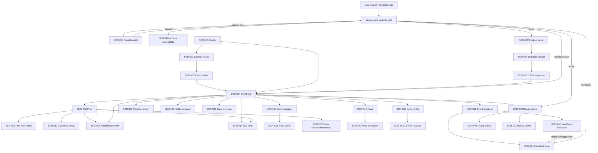

# Crew Next mobile screen and state inventory

- Status: Current behavioral contract
- Date: 2026-07-19
- Bead: `crew-paq.4.3`
- Contract alignment: `crew-paq.4.8`
- Journey basis: [Organizer and participant journeys](./organizer-participant-journeys.md)
- Domain basis: [ADR-003](../architecture/0003-event-domain.md)
- Sync basis: [ADR-005](../architecture/0005-offline-sync-protocol.md)
- Visual handoff: [Option 2 Figma handoff package](./figma-handoff/README.md)

## Scope lock

This is the behavioral source for mobile Figma capture. It defines routes,
states, transitions, data, focus, and platform frames without duplicating the
visual tokens in the handoff. Every frame is required to use the binding
[Option 2 / Crew Board direction](./figma-handoff/README.md); earlier visual
alternatives are superseded and must not be selected or blended.

`Community` means private, root-scoped Crew communication inside one event:
authorized members may read or contribute to that root's feed according to
their role. It does not mean public discovery, person/event follows,
cross-event profiles, or an open social feed. An active root member may follow
one sanitized product-feedback item in that same root; this is an item state,
not a social graph.

The inventory contains 30 screens, 15 overlays, and 20 critical reusable
components. The state matrix has 198 applicable screen states, producing 396
platform screen frames before named role/content variants. A state is a
separate Figma frame when it changes content, permission, recovery, or delivery
truth. There are no desktop frames.

## Mobile capture contract

Every screen and app-owned overlay is captured on both primary artboards. The
compact artboard is a required clipping and large-text check, not a third visual
design.

| Artboard ID |            Exact frame | Safe-area assumption                |     Usable content frame |
| ----------- | ---------------------: | ----------------------------------- | -----------------------: |
| `A-IOS`     | 393 x 852 pt, portrait | 59 pt top, 34 pt bottom, 0 pt sides | 393 x 759 pt at `(0,59)` |
| `A-AND`     | 412 x 915 dp, portrait | 24 dp top, 24 dp bottom, 0 dp sides | 412 x 867 dp at `(0,24)` |
| `A-COMPACT` | 375 x 667 pt, portrait | 20 pt top, 0 pt bottom, 0 pt sides  | 375 x 647 pt at `(0,20)` |

- The operating-system status bar, home/gesture area, keyboard, share sheet,
  photo picker, and date/time picker stay platform-native and are not redrawn.
- Persistent primary actions sit inside the usable content frame and remain
  reachable when content scrolls. With a keyboard open, the focused field and
  its error scroll above the native keyboard; the bottom safe area is consumed
  by the keyboard.
- `A-COMPACT` is checked at 200% text scaling with no clipped action, hidden
  error, horizontal-only navigation, or essential gesture.
- Frame names use
  `Screen/<ID>/<role>/<state>/<A-IOS|A-AND>` and
  `Overlay/<ID>/<state>/<A-IOS|A-AND>`.
- Each frame shows exactly one primary action. A screen may substitute that
  action in a mutually exclusive state; the state matrix names the substitute.

## Data and gateway reference

Screens read event content from SQLite. Gateway responses commit to SQLite
before a screen observes them. `API-S3` is the current delivery path only for
the mutation variants marked `Current` below; a current push endpoint does not
make planned `M-*` variants callable. It is not a screen-owned network cache.

### Gateway operations

`Current` rows are executable in the pinned Gateway OpenAPI. `Planned` rows are
screen requirements, not callable contracts; the named Bead blocks their UI.
Paths and operation IDs for current rows, plus the handoff's runtime
route-to-SCR crosswalk, are checked by `bun run check:product-contracts`.

| ID        | Status                   | Method and path                                                                         | Operation ID                            | Notes                                                                                                                                                                                                                                                                                                                                                  |
| --------- | ------------------------ | --------------------------------------------------------------------------------------- | --------------------------------------- | ------------------------------------------------------------------------------------------------------------------------------------------------------------------------------------------------------------------------------------------------------------------------------------------------------------------------------------------------------ |
| `API-A1`  | Current                  | `POST /core/v1/auth/magic-links`                                                        | `identityMagicLinksCreate`              | Email enumeration stays concealed.                                                                                                                                                                                                                                                                                                                     |
| `API-A2`  | Current                  | `POST /core/v1/auth/magic-links/redeem`                                                 | `identityMagicLinksRedeem`              | Token stays in the redacted body.                                                                                                                                                                                                                                                                                                                      |
| `API-A3`  | Current                  | `POST /core/v1/auth/refresh`                                                            | `identitySessionsRefresh`               | Refresh rotation is online-only.                                                                                                                                                                                                                                                                                                                       |
| `API-T1`  | Current                  | `GET /core/v1/event-templates`                                                          | `eventTemplatesList`                    | Bounded template catalog.                                                                                                                                                                                                                                                                                                                              |
| `API-T2`  | Current                  | `POST /core/v1/event-roots/{rootEventId}/template`                                      | `eventTemplateAdopt`                    | Idempotent existing-draft adoption guarded by root version, aggregate revision, active manager role, and caller-stable template event IDs.                                                                                                                                                                                                             |
| `API-E1`  | Current                  | `GET /core/v1/event-roots`                                                              | `eventRootsList`                        | Actor-scoped, privacy-safe root summaries for Events home.                                                                                                                                                                                                                                                                                             |
| `API-E2`  | Current                  | `POST /core/v1/event-roots`                                                             | `eventsCreate`                          | Client root ID plus required idempotency key.                                                                                                                                                                                                                                                                                                          |
| `API-E3`  | Current                  | `GET /core/v1/event-roots/{rootEventId}/publish-readiness`                              | `eventPublishReadinessGet`              | Authoritative versioned publish checklist; clients do not derive readiness locally.                                                                                                                                                                                                                                                                    |
| `API-E4`  | Current                  | `POST /core/v1/event-roots/{rootEventId}/publish`                                       | `eventsPublish`                         | Explicit idempotent publish transition guarded by root version and aggregate revision.                                                                                                                                                                                                                                                                 |
| `API-E5`  | Current                  | `GET /core/v1/event-roots/{rootEventId}`                                                | `eventsTreeGet`                         | Authorized event tree used to resolve exact setup-recovery targets; protected content remains concealed.                                                                                                                                                                                                                                               |
| `API-I0`  | Current                  | `GET /core/v1/event-roots/{rootEventId}/memberships`                                    | `eventMembershipsList`                  | Active root membership list for authorized management surfaces.                                                                                                                                                                                                                                                                                        |
| `API-I1`  | Current                  | `GET /core/v1/event-roots/{rootEventId}/invitations`                                    | `eventInvitationsList`                  | Sanitized owner/organizer administration view without invite secrets.                                                                                                                                                                                                                                                                                  |
| `API-I2`  | Current                  | `POST /core/v1/event-roots/{rootEventId}/invitations`                                   | `eventInvitationsCreate`                | Secret token is returned only at creation.                                                                                                                                                                                                                                                                                                             |
| `API-I3`  | Current                  | `POST /core/v1/invitations/preview`                                                     | `eventInvitationsPreview`               | Token stays in the redacted body, never a logged query.                                                                                                                                                                                                                                                                                                |
| `API-I4`  | Current                  | `POST /core/v1/invitations/redeem`                                                      | `eventInvitationsRedeem`                | Online-only idempotent redemption.                                                                                                                                                                                                                                                                                                                     |
| `API-S1`  | Current                  | `GET /core/v1/sync/bootstrap`                                                           | `syncBootstrapRead`                     | Root-scoped snapshot reset.                                                                                                                                                                                                                                                                                                                            |
| `API-S2`  | Current                  | `GET /core/v1/sync/pull`                                                                | `syncChangesList`                       | Bounded cursor pull.                                                                                                                                                                                                                                                                                                                                   |
| `API-S3`  | Current                  | `POST /core/v1/sync/push`                                                               | `syncMutationsApply`                    | Durable mutation delivery.                                                                                                                                                                                                                                                                                                                             |
| `API-S4`  | Current                  | `POST /core/v1/event-roots/{rootEventId}/attachments/uploads`                           | `eventAttachmentUploadsPrepare`         | Policy-bound upload preparation, including a consented root-scoped feedback screenshot target.                                                                                                                                                                                                                                                         |
| `API-S5`  | Current                  | `POST /core/v1/event-roots/{rootEventId}/attachments/uploads/{uploadId}/finalize`       | `eventAttachmentUploadsFinalize`        | Idempotent finalize/verification for the prepared attachment; a pending verification is not a delivered feedback submission.                                                                                                                                                                                                                           |
| `API-M1`  | Current                  | `GET /core/v1/event-roots/{rootEventId}/attachments/{attachmentId}/download`            | `eventAttachmentsDownload`              | Authorized short-lived URL.                                                                                                                                                                                                                                                                                                                            |
| `API-P1`  | Current                  | `GET /core/v1/places/search`                                                            | `placesSearch`                          | First-party candidate search with bounded signed cursors and catalog filters.                                                                                                                                                                                                                                                                          |
| `API-P2`  | Current                  | `POST /core/v1/places/enrichment-jobs`                                                  | `placeEnrichmentJobsCreate`             | Accepts a selected candidate or a bounded `search_miss` query/kind/country request and returns `202` immediately; status/retry stay API-owned while providers and secrets remain worker-only.                                                                                                                                                          |
| `API-P2R` | Current                  | `POST /core/v1/places/enrichment-jobs/{jobId}/review`                                   | `placeEnrichmentJobsReview`             | Idempotent manager approve/reject for cited completed `search_miss` fields. Approval materializes one reviewed candidate/place for the existing event-place flow; rejection materializes neither.                                                                                                                                                      |
| `API-P3`  | Current                  | `GET /core/v1/event-roots/{rootEventId}/places`                                         | `eventPlacesList`                       | Authorized root-scoped place snapshots used by publish setup recovery.                                                                                                                                                                                                                                                                                 |
| `API-P4`  | Current                  | `POST /core/v1/event-roots/{rootEventId}/places`                                        | `eventPlacesCreate`                     | Idempotent manager-only creation of the selected first-party place before capability binding.                                                                                                                                                                                                                                                          |
| `API-C1`  | Current                  | `PUT /core/v1/event-roots/{rootEventId}/events/{eventId}/capabilities/{capabilityType}` | `eventCapabilitiesReplace`              | Idempotent version-guarded replacement used by the narrow publish blocker recovery route.                                                                                                                                                                                                                                                              |
| `API-F1`  | Current                  | `GET /core/v1/event-roots/{rootEventId}/feedback/duplicate-suggestions`                 | `eventFeedbackDuplicateSuggestionsList` | Active-member-only canonical public suggestions. Unicode NFKC token matching is deterministic, not semantic similarity; the strict response contains only ID, title, status, and vote count. Signed cursors bind principal, root, and normalized query; the Gateway applies its authenticated-principal rate limit.                                    |
| `API-F2`  | Current                  | `POST /core/v1/feedback`                                                                | `feedbackCreate`                        | Idempotent PostgreSQL source-of-truth create; optional analytics is never authoritative.                                                                                                                                                                                                                                                               |
| `API-F3`  | Current                  | `GET /core/v1/feedback/{feedbackId}`                                                    | `feedbackGet`                           | Visibility-filtered detail; private diagnostics stay author/manager-only.                                                                                                                                                                                                                                                                              |
| `API-F4`  | Current                  | `PUT /core/v1/feedback/{feedbackId}/vote`                                               | `feedbackVotesSet`                      | Idempotent authenticated vote state.                                                                                                                                                                                                                                                                                                                   |
| `API-F5`  | Current                  | `POST /core/v1/feedback/{feedbackId}/comments`                                          | `feedbackCommentsCreate`                | Idempotent authenticated comment create.                                                                                                                                                                                                                                                                                                               |
| `API-F7`  | Planned — `crew-paq.6.2` | `POST /core/v1/feedback/attachments/uploads`                                            | —                                       | Reserved dedicated feedback-only upload path; the current routed screenshot flow does not depend on it and uses root-scoped `API-S4/S5`.                                                                                                                                                                                                               |
| `API-F8`  | Current                  | `GET /core/v1/event-roots/{rootEventId}/feedback`                                       | `eventFeedbackList`                     | Active-member-only canonical list with status and followed-item filters; author, diagnostics, attachments, and context IDs are absent.                                                                                                                                                                                                                 |
| `API-F9`  | Current                  | `GET /core/v1/event-roots/{rootEventId}/feedback/updates`                               | `eventFeedbackUpdatesList`              | Active-member-only canonical status history with actor/root/filter-bound signed cursors.                                                                                                                                                                                                                                                               |
| `API-F10` | Current                  | `GET /core/v1/event-roots/{rootEventId}/feedback/{feedbackId}`                          | `eventFeedbackGet`                      | Sanitized canonical detail or redirect without author/diagnostic PII.                                                                                                                                                                                                                                                                                  |
| `API-F11` | Current                  | `PUT /core/v1/event-roots/{rootEventId}/feedback/{feedbackId}/vote`                     | `eventFeedbackVotesSet`                 | Idempotent active-member vote; duplicate signal resolves to the canonical item.                                                                                                                                                                                                                                                                        |
| `API-F12` | Current                  | `POST /core/v1/event-roots/{rootEventId}/feedback/{feedbackId}/comments`                | `eventFeedbackCommentsCreate`           | Idempotent active-member comment on sanitized canonical feedback.                                                                                                                                                                                                                                                                                      |
| `API-F13` | Current                  | `PUT /core/v1/event-roots/{rootEventId}/feedback/{feedbackId}/follow`                   | `eventFeedbackFollowsSet`               | Idempotent server-authoritative item follow inside one active root.                                                                                                                                                                                                                                                                                    |
| `API-R1`  | Current                  | `GET /core/v1/event-roots/{rootEventId}/recap`                                          | `eventRecapsGet`                        | Versioned, role-authorized immutable recap projection.                                                                                                                                                                                                                                                                                                 |
| `API-R2`  | Current                  | `POST /core/v1/event-roots/{rootEventId}/recap/generate`                                | `eventRecapsGenerate`                   | Online-only immutable generation from bounded authoritative sources.                                                                                                                                                                                                                                                                                   |
| `API-R3`  | Current                  | `POST /core/v1/event-roots/{rootEventId}/recap/publish`                                 | `eventRecapsPublish`                    | Explicit lifecycle/version guard with source-eligibility and membership-version revalidation.                                                                                                                                                                                                                                                          |
| `API-R4`  | Current                  | `DELETE /core/v1/event-roots/{rootEventId}/recap`                                       | `eventRecapsRemove`                     | Permanently conceals every recap version through the removal cutoff.                                                                                                                                                                                                                                                                                   |
| `API-R5`  | Current                  | `POST /core/v1/event-roots/{rootEventId}/recap/share-links`                             | `eventRecapShareLinksCreate`            | Owner/organizer-only create-or-rotate for one seven-day opaque link. The required body names `recapVersion` and `projectionConsent: "title-only-reviewed"`; compare-and-set binds the link to that exact reviewed current published version. The token exists only in the success response or an authorized exact replay.                              |
| `API-R6`  | Current                  | `DELETE /core/v1/event-roots/{rootEventId}/recap/share-links/{shareLinkId}`             | `eventRecapShareLinksRevoke`            | Owner/organizer-only immediate revocation of one identified link.                                                                                                                                                                                                                                                                                      |
| `API-R7`  | Current                  | `POST /core/v1/recap-share-links/resolve`                                               | `eventRecapShareLinksResolve`           | Public online resolver returning only recap title plus reindexed titled items. Root/source IDs, bodies, media, provenance and lifecycle metadata are absent; every unavailable state is the same concealed `404`.                                                                                                                                      |
| `API-R8`  | Current                  | `POST /core/v1/event-roots/{rootEventId}/recap/external-grants`                         | `eventRecapExternalGrantsDecide`        | Appends one exact recap/source-version body or caption-text `grant`/`withdraw` decision without copying content. Event bodies require current manager authority; feed bodies and captions require separate source-author/attachment-creator and manager decisions. Caption writes require a server-issued opaque field ref and are server-default-off. |
| `API-R9`  | Current                  | `POST /core/v1/event-roots/{rootEventId}/recap/external-share-links`                    | `eventRecapExternalShareLinksCreate`    | Manager-only exact-field link creation after every selected body/caption has all current grants. The immutable field set is version-bound, rotates the prior active recap link and never enables attachment bytes, media URLs or identifiable media. Caption fields are server-default-off.                                                            |
| `API-R10` | Current                  | `POST /core/v1/recap-external-share-links/resolve`                                      | `eventRecapExternalShareLinksResolve`   | Returns only recap title, event-item titles, selected approved bodies and, while the server gate is enabled, selected approved caption strings. Any link, grant, authority, source, attachment, membership or version drift returns the same `404`; identities, provenance, internal IDs, tokens, media and unapproved fields are absent.              |

Current `API-C1`, `API-E2`, `API-E4`, `API-F2`, `API-F4`, `API-F5`,
`API-F11`, `API-F12`, `API-F13`, `API-I2`, `API-I4`, `API-P2`, `API-P2R`,
`API-P4`, `API-R2`, `API-R3`, `API-R4`, `API-R5`, `API-R6`, `API-R8`, `API-R9`, `API-S3`, `API-S4`, `API-S5`, and
`API-T2` require idempotency. Invitation
creation/redemption, event or recap
publication, identity, unseen-root bootstrap, and external sharing wait for a
connection rather than showing a false queued success.

### SQLite records and mutation families

| ID             | Local record                                                                                                                                                                                                                                                            |
| -------------- | ----------------------------------------------------------------------------------------------------------------------------------------------------------------------------------------------------------------------------------------------------------------------- |
| `SQL-ROOTS`    | Root summaries, current membership/role, lifecycle, and offline-availability flag                                                                                                                                                                                       |
| `SQL-GRAPH`    | Recursive events, hierarchy order, versions, and tombstones                                                                                                                                                                                                             |
| `SQL-PLAN`     | Itinerary, capabilities, place snapshots/candidates, enrichment state, and versions                                                                                                                                                                                     |
| `SQL-ACTIONS`  | Personal requests, own private responses, and completion state                                                                                                                                                                                                          |
| `SQL-FEED`     | Feed entries/revisions/reactions, target context, and attachment metadata                                                                                                                                                                                               |
| `SQL-GOLF`     | Round setup, holes, own scores, leaderboard projection, and versions                                                                                                                                                                                                    |
| `SQL-TEAM`     | Teams, assignments, decisions, responses, aggregates, and versions                                                                                                                                                                                                      |
| `SQL-SYNC`     | Cursor, snapshot/revision, last-sync time, scope version, and retry state                                                                                                                                                                                               |
| `SQL-OUTBOX`   | Immutable root mutations, overlays, attempts, dependency order, and dead letters                                                                                                                                                                                        |
| `SQL-ATTACH`   | Local URI, checksum, bytes, upload lease, preview, and transfer state                                                                                                                                                                                                   |
| `SQL-FEEDBACK` | Current account-/root-scoped sanitized Community cache, status updates, durable submissions/attachments, and a 20-query SHA-256-keyed duplicate suggestion cache; cached suggestions require local active membership and contain only ID, title, status, and vote count |
| `SQL-RECAP`    | Generated draft, source links, privacy decisions, versions, and publication state                                                                                                                                                                                       |
| `SQL-DRAFTS`   | Unsaved/invalid form values and intended return route                                                                                                                                                                                                                   |

The semantic mutation labels used below map to current wire kinds or to planned
contract requirements. This matrix is authoritative for their availability.

| Mutation label                                                                 | Status                                   | Delivery contract and owner                                                                                                                                                                                                                                                                                                                                                                                                                                                      |
| ------------------------------------------------------------------------------ | ---------------------------------------- | -------------------------------------------------------------------------------------------------------------------------------------------------------------------------------------------------------------------------------------------------------------------------------------------------------------------------------------------------------------------------------------------------------------------------------------------------------------------------------- |
| `M-root.update`, `M-event.create`, `M-event.update`                            | Current                                  | `API-S3`; root updates use the current `event.update` wire kind.                                                                                                                                                                                                                                                                                                                                                                                                                 |
| `M-event.reorder`                                                              | Current                                  | `API-S3` via `event.children.reorder`; the current Gateway also exposes `POST /core/v1/event-roots/{rootEventId}/events/{eventId}/children/reorder` for online delivery.                                                                                                                                                                                                                                                                                                         |
| `M-itinerary.create`, `M-itinerary.update`, `M-itinerary.reorder`              | Current                                  | `API-S3`.                                                                                                                                                                                                                                                                                                                                                                                                                                                                        |
| `M-capability.replace`, `M-capability.remove`                                  | Current                                  | `API-S3`; the narrow online publish recovery may instead use version-guarded `API-C1`.                                                                                                                                                                                                                                                                                                                                                                                           |
| `M-feed.create`, `M-feed.revise`, `M-feed.remove`, `M-feed.reaction.set`       | Current                                  | `API-S3`; private and root-scoped under current membership.                                                                                                                                                                                                                                                                                                                                                                                                                      |
| `M-attachment.commit`                                                          | Current                                  | Generic `API-S3` support after `API-S4/S5`; the current `TeamFeed` photo path treats successful `API-S5` finalize as the authoritative server commit and does not enqueue a second attachment commit.                                                                                                                                                                                                                                                                            |
| `M-personal-response.set`                                                      | Planned                                  | Personal-action schema, authorization, sync conflict, and offline convergence remain vertical requirements; no current mutation contract is claimed.                                                                                                                                                                                                                                                                                                                             |
| `M-golf.round.replace`                                                         | Current — `crew-paq.7.3.1`               | Owner/organizer-only `API-S3` mutation for exact 18-hole setup, eligible signed-handicap players, and teams of at most four. It shares the existing outbox sequence and converges through bootstrap/pull; manager-only `golfRoster` carries the full roster while participants retain only their own `golfPlayer`. Actor-scoped tombstones remove stale self-player/score state after round removal or viewer demotion, and applied receipt/HTTP replays recheck current policy. |
| `M-golf.score.set`                                                             | Current score transport — `crew-paq.7.3` | `API-S3` uses the existing `syncMutationsApply` stream with actor-derived score identity and server-calculated handicap/Stableford fields. Bootstrap/pull provide own player/scores plus the shared leaderboard after `M-golf.round.replace`.                                                                                                                                                                                                                                    |
| `M-team.assignments.publish`, `M-team.decision.replace`, `M-team.response.set` | Current transport — `crew-paq.8.2.1`     | `API-S3` carries manager-only assignment publication and decision replacement plus actor-bound single-response writes. Event Service, Gateway, generated Mobile Client, routed native screens, `SQL-TEAM`, durable Outbox convergence, and the closed local Team vertical are current; generic conflict, complete state coverage, and release acceptance remain separate boundaries.                                                                                             |
| `M-recap.draft.update`                                                         | Planned — `crew-paq.3.6`                 | Current `API-R2/R3/R4` cover authoritative server generation, publication, and removal; manually editing a recap draft and converging that edit offline are not current Gateway contracts.                                                                                                                                                                                                                                                                                       |

Invite tokens and authentication return routes live in protected short-lived
route storage, never in analytics or the event SQLite tables.

## Navigation graph

Arrows describe route resolution, not visual placement or animation. `Gate`
means session plus root-membership verification before private content appears.

## Screen specifications

The artboard field inherited by every `SCR-*` specification is exactly
`A-IOS` 393 x 852 pt with 59/34 pt top/bottom safe areas, `A-AND` 412 x 915 dp
with 24/24 dp top/bottom safe areas, and the `A-COMPACT` check. The common focus
order is heading, status, content, primary action. The per-screen focus note
identifies the first focus target after entry, validation, or an async state
change. `ST-*` points to the exact state-frame row in the next section.

### `SCR-001` - Events

| Field                 | Specification                                                                                                |
| --------------------- | ------------------------------------------------------------------------------------------------------------ |
| Route / purpose       | `Events`; signed-in root list, entry to local-first creation, and secondary safe sign-out                    |
| Roles / journeys      | All signed-in roles; `O-01`, `P-04`, `S-01`                                                                  |
| Entry -> exit         | App start or back from a root -> `SCR-002`, gated `SCR-004`, or native sign-out confirmation                 |
| One primary action    | `Create event`                                                                                               |
| Secondary action      | `Sign out`; native confirmation can cancel or end the session after locally retained private data is removed |
| Gateway + SQLite      | `API-E1`, background `API-S2`; `SQL-ROOTS`, `SQL-SYNC`, `SQL-OUTBOX`                                         |
| State frames          | `ST-SCR-001`                                                                                                 |
| Accessibility / focus | Focus `Events`; cards announce title, dates, role, offline and queued truth; sign-out names confirmation     |
| Deep link             | Root links bypass this screen after Gate; denied links return here through `SCR-080`                         |

### `SCR-002` - Starting shape

| Field                 | Specification                                                                                  |
| --------------------- | ---------------------------------------------------------------------------------------------- |
| Route / purpose       | Starting-shape step in `CreateEvent`; choose bundled Turkey golf, team-event, or blank schema  |
| Roles / journeys      | Prospective owner; `O-01`, `O-02`                                                              |
| Entry -> exit         | `SCR-001` -> `SCR-003`; back retains the local draft                                           |
| One primary action    | `Use this setup`                                                                               |
| Gateway + SQLite      | Optional `API-T1`; `SQL-DRAFTS`, bundled template schema                                       |
| State frames          | `ST-SCR-002`                                                                                   |
| Accessibility / focus | Focus `Choose a setup`; each option announces included capabilities without relying on imagery |
| Deep link             | Not externally addressable; restored only as the signed-in local create route                  |

### `SCR-003` - Event details editor

| Field                 | Specification                                                                                          |
| --------------------- | ------------------------------------------------------------------------------------------------------ |
| Route / purpose       | New-root details in `CreateEvent` and existing-root `EventBasicsEdit`; title, zone, dates, description |
| Roles / journeys      | Prospective owner, owner, organizer; `O-03`, `S-02`, `S-04`                                            |
| Entry -> exit         | `SCR-002` in `CreateEvent`, hub settings, or conflict return -> `SCR-004` or prior route               |
| One primary action    | `Save details`                                                                                         |
| Gateway + SQLite      | New root `API-E2`; edits `API-S3` + `M-root.update`; `SQL-ROOTS`, `SQL-DRAFTS`, `SQL-OUTBOX`           |
| State frames          | `ST-SCR-003`                                                                                           |
| Accessibility / focus | Focus first invalid field on submit; dates announce local day/time/zone and cross-zone ambiguity       |
| Deep link             | Private editor links require organizer Gate; others resolve read-only to `SCR-004`                     |

### `SCR-004` - Event hub and action center

| Field                 | Specification                                                                                                                                           |
| --------------------- | ------------------------------------------------------------------------------------------------------------------------------------------------------- |
| Route / purpose       | `EventHub({rootEventId})`; role-correct summary, now/next, pending action, feed/plan/recap entry                                                        |
| Roles / journeys      | Owner, organizer, participant, viewer; `P-04`, `P-05`, `G-P-02`, `T-P-02`, `S-01`, `R-P-01`                                                             |
| Entry -> exit         | Event card, completed download, or Gate -> plan, live item, action, feed, sync, feedback, recap                                                         |
| One primary action    | Deterministic single CTA: pending request `Complete next action`; live item `Open current/next item`; ready `View plan`; organizer draft `Review event` |
| Gateway + SQLite      | Background `API-S2`; `SQL-ROOTS`, `SQL-GRAPH`, `SQL-PLAN`, `SQL-ACTIONS`, `SQL-FEED`, `SQL-SYNC`, `SQL-RECAP`                                           |
| State frames          | `ST-SCR-004`; separate owner/organizer, participant, and viewer baseline frames                                                                         |
| Accessibility / focus | Focus event title, then current sync truth; CTA resolver never exposes a disabled write control to viewers                                              |
| Deep link             | Root link lands here after Gate/bootstrap; target links continue only after local changes apply                                                         |

### `SCR-010` - Plan tree and timeline

| Field                 | Specification                                                                                                                                                                                                                                                                                                                                                                                                                                                                                                                                                                                                                                                                                                                              |
| --------------------- | ------------------------------------------------------------------------------------------------------------------------------------------------------------------------------------------------------------------------------------------------------------------------------------------------------------------------------------------------------------------------------------------------------------------------------------------------------------------------------------------------------------------------------------------------------------------------------------------------------------------------------------------------------------------------------------------------------------------------------------------ |
| Route / purpose       | `Plan({rootEventId,eventId?})`; recursive hierarchy plus chronological itinerary                                                                                                                                                                                                                                                                                                                                                                                                                                                                                                                                                                                                                                                           |
| Roles / journeys      | All roles; editing for owner/organizer; `O-04`, `O-06`, `G-O-01`, `G-O-02`, `T-O-01`                                                                                                                                                                                                                                                                                                                                                                                                                                                                                                                                                                                                                                                       |
| Entry -> exit         | `SCR-004` or target link -> item editor, setup, readiness, or live item                                                                                                                                                                                                                                                                                                                                                                                                                                                                                                                                                                                                                                                                    |
| One primary action    | Editor `Add to plan`; participant/viewer `Open selected item`                                                                                                                                                                                                                                                                                                                                                                                                                                                                                                                                                                                                                                                                              |
| Gateway + SQLite      | Background `API-S2`; current `API-S3` for event/itinerary mutations including `M-event.reorder` via `event.children.reorder`; `SQL-GRAPH`, `SQL-PLAN`, `SQL-SYNC`, `SQL-OUTBOX`                                                                                                                                                                                                                                                                                                                                                                                                                                                                                                                                                            |
| State frames          | `ST-SCR-010`; golf and team fixture content are separate data frames, not separate screens                                                                                                                                                                                                                                                                                                                                                                                                                                                                                                                                                                                                                                                 |
| Accessibility / focus | Focus `Plan`; tree rows expose heading level, parent, expanded state, and sibling position without indentation alone                                                                                                                                                                                                                                                                                                                                                                                                                                                                                                                                                                                                                       |
| Deep link             | Root-plan link focuses heading; child/item link selects target or shows `OVR-012` tombstone before current plan                                                                                                                                                                                                                                                                                                                                                                                                                                                                                                                                                                                                                            |
| Native status         | `NATIVE-CURRENT-ROUTED`, `DATA-CURRENT`: recursive cached tree and itinerary, role-correct actions, durable optimistic item rows, child-event and itinerary reorder controls, sync state, and issue truth are code/test current. The native packet at `apps/mobile/evidence/plan-editor-live-2026-07-27` retains historical Android queued/conflict/tombstone Plan evidence at font scales 1.0/2.0 and older-provenance iOS evidence. Its accepted current-source iOS matrix adds queued/conflict/tombstone Plan, Editor, and Live evidence at medium/Accessibility Extra Large, hash-bound in `runtime/oracles/ios-current-state-matrix.json`. The packet is simulator/emulator only; distribution-signed physical devices, VoiceOver/TalkBack, production, external Figma, and uncaptured state variants remain pending. |

### `SCR-011` - Plan item editor

| Field                 | Specification                                                                                                                                                                                                                                                                                                                                                                                                                                                                                                                                                                                                  |
| --------------------- | -------------------------------------------------------------------------------------------------------------------------------------------------------------------------------------------------------------------------------------------------------------------------------------------------------------------------------------------------------------------------------------------------------------------------------------------------------------------------------------------------------------------------------------------------------------------------------------------------------------- |
| Route / purpose       | `PlanItemEditor({rootEventId,parentId,type,id?})`; one schema-driven editor for child events and itinerary items                                                                                                                                                                                                                                                                                                                                                                                                                                                                                               |
| Roles / journeys      | Owner, organizer; `O-04`, `G-O-01`, `G-O-02`, `G-O-03`, `T-O-01`, `T-O-03`, `S-02`                                                                                                                                                                                                                                                                                                                                                                                                                                                                                                                             |
| Entry -> exit         | `SCR-010` through `OVR-001/002` or edit link -> plan or changed live item                                                                                                                                                                                                                                                                                                                                                                                                                                                                                                                                      |
| One primary action    | Mode label only: `Add travel item`, `Add round`, `Add agenda item`, `Save`, or live edit `Publish update`                                                                                                                                                                                                                                                                                                                                                                                                                                                                                                      |
| Gateway + SQLite      | `API-P1`, optional `API-P2`; current `API-S3` with `M-event.create`, `M-event.update`, `M-itinerary.create`, `M-itinerary.update`, and `M-itinerary.reorder`; `SQL-GRAPH`, `SQL-PLAN`, `SQL-DRAFTS`, `SQL-OUTBOX`                                                                                                                                                                                                                                                                                                                                                                                              |
| State frames          | `ST-SCR-011`; capture travel, golf round, session/activity, and generic note field schemas                                                                                                                                                                                                                                                                                                                                                                                                                                                                                                                     |
| Accessibility / focus | Focus title or first invalid field; type/time/place controls have text labels and preserve entered values on every recovery                                                                                                                                                                                                                                                                                                                                                                                                                                                                                    |
| Deep link             | Organizer-only editor link; downgrade opens read-only `SCR-014` and preserves local draft through `SCR-051`                                                                                                                                                                                                                                                                                                                                                                                                                                                                                                    |
| Native status         | The itinerary-item create/update, child-event editing, child-event reorder, and itinerary reorder slices are `NATIVE-CURRENT-ROUTED`, `DATA-CURRENT` with restart-safe outbox, account fencing, role enforcement, and conflict/permission/deleted recovery. The native packet at `apps/mobile/evidence/plan-editor-live-2026-07-27` retains historical Plan Item Editor/action-area layout runs and accepted current-source iOS queued/conflict/tombstone Editor evidence at medium/Accessibility Extra Large. The Default-size conflict Editor provenance exception is recorded in its oracle. Generalized place creation, distribution-signed physical devices, VoiceOver/TalkBack, production, external Figma, and uncaptured state variants remain pending. |

### `SCR-012` - Capability setup

| Field                 | Specification                                                                                                                               |
| --------------------- | ------------------------------------------------------------------------------------------------------------------------------------------- |
| Route / purpose       | `CapabilitySetup({rootEventId,eventId,type})`; configure only attached travel, lodging, transport, golf, or team capability                 |
| Roles / journeys      | Owner, organizer; `O-05`, `G-O-02`, `T-O-02`, `S-02`                                                                                        |
| Entry -> exit         | Plan or editor -> plan; removal with dependencies -> `OVR-005`                                                                              |
| One primary action    | `Save setup`                                                                                                                                |
| Gateway + SQLite      | `API-P1`, optional `API-P2`; current `API-S3` with `M-capability.replace` and `M-capability.remove`; `SQL-PLAN`, `SQL-DRAFTS`, `SQL-OUTBOX` |
| State frames          | `ST-SCR-012`; each capability schema is a component variant, not a new route                                                                |
| Accessibility / focus | Focus capability heading; conditional fields announce why they appeared and dependency errors focus the affected section                    |
| Deep link             | Organizer Gate only; participant/viewer target resolves to corresponding read-only plan context                                             |

### `SCR-013` - Readiness review

| Field                 | Specification                                                                                                                                                                                                                                                                                        |
| --------------------- | ---------------------------------------------------------------------------------------------------------------------------------------------------------------------------------------------------------------------------------------------------------------------------------------------------- |
| Route / purpose       | `EventPublish({rootEventId})`; participant-faithful preview, blockers, optional improvements, publication                                                                                                                                                                                            |
| Roles / journeys      | Owner, organizer; `O-06`, `O-08`                                                                                                                                                                                                                                                                     |
| Entry -> exit         | `SCR-010`/hub -> review; basics blocker -> `EventBasicsEdit`; template/capability/place blocker -> `EventSetupRecovery`; success returns to the refetched review or `SCR-004`                                                                                                                        |
| One primary action    | Current: basics blocker `Edit detail`, setup blocker `Edit setup`, blocked `Check again`, ready `Publish event`                                                                                                                                                                                      |
| Gateway + SQLite      | Review/publish `API-E3/E4`; setup recovery reads `API-E5`, `API-T1`, `API-P1/P3`, runs bounded `search_miss` create/review through `API-P2/P2R`, and writes online through `API-T2`, `API-P4`, `API-C1`; account/root v18 readiness/attempt cache plus `event.update` basics overlay in `SQL-OUTBOX` |
| State frames          | `ST-SCR-013`                                                                                                                                                                                                                                                                                         |
| Accessibility / focus | Focus `Review event`, then blocker summary; preview traversal equals participant read order and conceals drafts                                                                                                                                                                                      |
| Deep link             | Private organizer route only; stale or unauthorized route returns to role-correct hub                                                                                                                                                                                                                |

The Option-2 route, cached review, authoritative online readiness, durable
idempotent publish replay, sync guard, conflict comparison, and safe
owner/organizer concealment are code-current. Title, description, start, and end
blockers now open a dedicated existing-draft editor. It validates IANA local
time including DST gaps and ambiguous folds, persists exactly one account/root
`event.update` with a restart overlay, and returns to a refetched review. Offline
review intentionally has no publish or sync CTA because publication is never
queued. Template adoption, default-capability restoration, first-party place
search/creation, and primary-place binding are current online-only recovery
actions with manager, version, conflict, account-switch, and refetch guards.
A zero-result place search may disclose a bounded worldwide `search_miss` path
with an explicit country, bounded polling, and cited-field review. Approve and
reject are explicit idempotent manager decisions: approval continues through
the existing event-place creation and capability bind, while rejection creates
and binds nothing. Safe retry/unavailable states retain query and country and
never expose provider prompts or secrets. This does not make generalized
`SCR-012` capability setup current. Child-event editing and reorder are current
in `SCR-010/011`. The closed local Turkey journey provides service-backed
publication evidence, while native readiness-review captures and visual
parity, distribution-signed physical devices, VoiceOver/TalkBack, a
provider-enabled live worker, production, external Figma, and complete
platform/state coverage remain pending.

### `SCR-014` - Live item detail

| Field                 | Specification                                                                                                                                                                                                                                                                                                                                                                                                                                                                                                                                                                                                                                   |
| --------------------- | ----------------------------------------------------------------------------------------------------------------------------------------------------------------------------------------------------------------------------------------------------------------------------------------------------------------------------------------------------------------------------------------------------------------------------------------------------------------------------------------------------------------------------------------------------------------------------------------------------------------------------------------------- |
| Route / purpose       | `LiveItem({rootEventId,itemId})`; derives the authorized event and shows now/next flight, transfer, stay, round, session, activity, or meal in context                                                                                                                                                                                                                                                                                                                                                                                                                                                                                          |
| Roles / journeys      | All roles; `G-P-02`, `T-P-02`, `C-01`, `T-O-03`                                                                                                                                                                                                                                                                                                                                                                                                                                                                                                                                                                                                 |
| Entry -> exit         | Hub, plan, feed, or deep link -> adjacent item, feed context, or updated plan                                                                                                                                                                                                                                                                                                                                                                                                                                                                                                                                                                   |
| One primary action    | Current/upcoming `Open next item`; moved/cancelled `View updated plan`; after last team item `View recap`                                                                                                                                                                                                                                                                                                                                                                                                                                                                                                                                       |
| Gateway + SQLite      | Background `API-S2`, media `API-M1`; `SQL-GRAPH`, `SQL-PLAN`, `SQL-FEED`, `SQL-SYNC`                                                                                                                                                                                                                                                                                                                                                                                                                                                                                                                                                            |
| State frames          | `ST-SCR-014`; travel and team content variants share the route                                                                                                                                                                                                                                                                                                                                                                                                                                                                                                                                                                                  |
| Accessibility / focus | Focus item title then status; local day/time/zone, moved/cancelled state, room/place, and last sync are spoken                                                                                                                                                                                                                                                                                                                                                                                                                                                                                                                                  |
| Deep link             | Gate root first, apply pull, then focus target; tombstone opens `OVR-012` and current plan                                                                                                                                                                                                                                                                                                                                                                                                                                                                                                                                                      |
| Native status         | `NATIVE-CURRENT-ROUTED`, `DATA-CURRENT`: exact optimistic/offline item lookup, role-safe one-primary-action resolution, adjacent-item navigation, local time/named place/details, sync truth, denial concealment, and removed-target return to the updated plan are code/test current. The native packet at `apps/mobile/evidence/plan-editor-live-2026-07-27` retains historical Live Item/action-area layout runs and accepted current-source iOS queued/conflict/tombstone Live evidence at medium/Accessibility Extra Large, including the existing removed-target gate where applicable. Distribution-signed physical devices, VoiceOver/TalkBack, production, external Figma, and remaining state coverage remain pending. |

### `SCR-020` - Invite manager

| Field                 | Specification                                                                                                                                                                                                                                                                                                                                                                                                                                                                                                                                     |
| --------------------- | ------------------------------------------------------------------------------------------------------------------------------------------------------------------------------------------------------------------------------------------------------------------------------------------------------------------------------------------------------------------------------------------------------------------------------------------------------------------------------------------------------------------------------------------------- |
| Route / purpose       | `Invites({rootEventId})`; members, active/revoked/expired invites, and role limits                                                                                                                                                                                                                                                                                                                                                                                                                                                                |
| Roles / journeys      | Owner, organizer; `O-07`, `O-08`                                                                                                                                                                                                                                                                                                                                                                                                                                                                                                                  |
| Entry -> exit         | Hub management -> invite editor, revoke/status details, or a replacement-link action; an existing secret is never retrievable                                                                                                                                                                                                                                                                                                                                                                                                                     |
| One primary action    | `Create invite`                                                                                                                                                                                                                                                                                                                                                                                                                                                                                                                                   |
| Gateway + SQLite      | `API-I0`, `API-I1`; `SQL-ROOTS`, cached membership/invite summaries in `SQL-DRAFTS` without plain tokens                                                                                                                                                                                                                                                                                                                                                                                                                                          |
| State frames          | `ST-SCR-020`; owner and organizer permission frames are distinct                                                                                                                                                                                                                                                                                                                                                                                                                                                                                  |
| Accessibility / focus | Focus `Invitations`; role, status, expiry, and remaining uses are announced per row                                                                                                                                                                                                                                                                                                                                                                                                                                                               |
| Deep link             | Organizer Gate only; participants/viewers return to hub with no management controls                                                                                                                                                                                                                                                                                                                                                                                                                                                               |
| Native status         | `NATIVE-CURRENT-ROUTED`, `DATA-CURRENT`: owner/organizer manager, token-free cache, bounded pagination, revoke retry, permission concealment, and offline states are code/test current. Sanitized iOS/Android simulator evidence is current across 7/7 runs, including owner create/refresh, iOS Large Text, and the organizer manager at Android font scale 2.0. Native Zurich DST-overlap round-trip acceptance is NO-GO with the current nondeterministic fold picker harness, and iOS Share Sheet dismissal has no final retained artifact. Physical distribution-signed devices, VoiceOver/TalkBack, and an external Figma update remain pending under `crew-paq.3.5.8.1`. |

### `SCR-021` - Invite editor

| Field                 | Specification                                                                                                                                                                                                                                                                                                                                                                                                                                                                                                                                |
| --------------------- | -------------------------------------------------------------------------------------------------------------------------------------------------------------------------------------------------------------------------------------------------------------------------------------------------------------------------------------------------------------------------------------------------------------------------------------------------------------------------------------------------------------------------------------------- |
| Route / purpose       | `InviteEditor({rootEventId})`; intended role, optional email hint, required expiry, and required use limit                                                                                                                                                                                                                                                                                                                                                                                                                                   |
| Roles / journeys      | Owner, organizer with narrower role choices; `O-07`                                                                                                                                                                                                                                                                                                                                                                                                                                                                                          |
| Entry -> exit         | `SCR-020` -> manager; success presents `OVR-007` with the once-returned token                                                                                                                                                                                                                                                                                                                                                                                                                                                                |
| One primary action    | `Create invite`                                                                                                                                                                                                                                                                                                                                                                                                                                                                                                                              |
| Gateway + SQLite      | `API-I2`; `SQL-DRAFTS` only, never token persistence or queued-success state                                                                                                                                                                                                                                                                                                                                                                                                                                                                 |
| State frames          | `ST-SCR-021`                                                                                                                                                                                                                                                                                                                                                                                                                                                                                                                                 |
| Accessibility / focus | Focus intended role; unavailable organizer role is absent for organizers, not disabled; errors retain policy fields                                                                                                                                                                                                                                                                                                                                                                                                                          |
| Deep link             | Not externally addressable; expired local form route returns to manager without a token; a cancelled native share can be retried only while the once-returned token remains in the in-memory success state                                                                                                                                                                                                                                                                                                                                   |
| Native status         | `NATIVE-CURRENT-ROUTED`, `DATA-CURRENT`: role policy, token-free local draft, stable create replay, once-only in-memory sharing, and the system-native iOS/Android expiry picker are code/test current. Sanitized 7/7 simulator runs cover owner/organizer role behavior, picker cancel/confirm, create, iOS Large Text, and Android font scale 2.0. Native Zurich DST-overlap round-trip acceptance is NO-GO with the current nondeterministic fold picker harness, and iOS Share Sheet dismissal has no final retained artifact. Physical distribution-signed devices, VoiceOver/TalkBack, and an external Figma update remain pending under `crew-paq.3.5.8.1`. |

### `SCR-022` - Invite preview

| Field                 | Specification                                                                                                               |
| --------------------- | --------------------------------------------------------------------------------------------------------------------------- |
| Route / purpose       | `InvitePreview({opaqueToken})`; public safe title, dates, intended role, email-binding hint, and availability               |
| Roles / journeys      | Signed out or signed in; `P-01`                                                                                             |
| Entry -> exit         | Invite universal link -> `SCR-023` or `SCR-024`; unavailable -> organizer-contact fallback                                  |
| One primary action    | Valid `Join event`; unavailable `Ask organizer`; offline `Try when online`                                                  |
| Gateway + SQLite      | `API-I3`; no private SQLite read, protected pending-link route only                                                         |
| State frames          | `ST-SCR-022`; available, generic unavailable, retryable, offline, and email-bound hint frames only                          |
| Accessibility / focus | Focus event-safe title or unavailable heading; skeleton contains no stale private content; errors reveal no membership      |
| Deep link             | Cold/warm canonical invite target; token is redacted from logs, analytics, crash data, and app-controlled clipboard history |

### `SCR-023` - Email identity

| Field                 | Specification                                                                                              |
| --------------------- | ---------------------------------------------------------------------------------------------------------- |
| Route / purpose       | `EmailSignIn({returnRoute})`; establish/resume first-party session without losing target                   |
| Roles / journeys      | Signed out; `P-02`, `C-01`, `S-03`                                                                         |
| Entry -> exit         | Session Gate -> preserved invite/root/feed/feedback/recap route after completion                           |
| One primary action    | `Continue with email`; expired-link state substitutes `Send a new link`                                    |
| Gateway + SQLite      | `API-A1`, `API-A2`, `API-A3`; no event SQLite read, protected return route and email draft                 |
| State frames          | `ST-SCR-023`                                                                                               |
| Accessibility / focus | Focus email field; sending is cancellable; result announcement occurs once and does not consume an invite  |
| Deep link             | Auth/magic-link completion restores the exact sanitized route; email-bound mismatch returns to this screen |

### `SCR-024` - Invitation acceptance

| Field                 | Specification                                                                                             |
| --------------------- | --------------------------------------------------------------------------------------------------------- |
| Route / purpose       | `InviteAccept({opaqueToken})`; confirm role and atomically redeem as authenticated user                   |
| Roles / journeys      | Authenticated invitee; `P-03`                                                                             |
| Entry -> exit         | Preview/auth -> `SCR-025`; terminal result -> safe invite fallback                                        |
| One primary action    | `Accept invitation`; unknown timeout substitutes `Check membership`                                       |
| Gateway + SQLite      | `API-I4`, then membership check through `API-E1`; `SQL-ROOTS` only after confirmed result                 |
| State frames          | `ST-SCR-024`; unknown result, generic unavailable, and email mismatch are distinct safe frames            |
| Accessibility / focus | Focus `Accept invitation`; role and event-safe summary precede action; progress never implies consumption |
| Deep link             | Replayed token for same user yields the same membership then continues to pending target                  |

### `SCR-025` - Offline download

| Field                 | Specification                                                                                                |
| --------------------- | ------------------------------------------------------------------------------------------------------------ |
| Route / purpose       | `OfflineDownload({rootEventId,returnTarget?})`; coherent staged snapshot before offline-ready truth          |
| Roles / journeys      | New active member; `P-04`                                                                                    |
| Entry -> exit         | Accepted invite or unseen root -> `SCR-004` or original item target after atomic swap                        |
| One primary action    | Complete `Open event`; failed/partial `Download again`; storage state `Free space`                           |
| Gateway + SQLite      | `API-S1`, then `API-S2`; staging plus `SQL-ROOTS` through `SQL-RECAP`, `SQL-SYNC`, preserved `SQL-OUTBOX`    |
| State frames          | `ST-SCR-025`; bounded progress, resumable interruption, cursor expiry restart, storage pressure, removal     |
| Accessibility / focus | Focus download heading; determinate page/record progress is announced at bounded intervals, not every record |
| Deep link             | Holds sanitized target until final snapshot swap; partial data never renders as a complete private root      |

### `SCR-030` - Personal action form

| Field                 | Specification                                                                                                                                           |
| --------------------- | ------------------------------------------------------------------------------------------------------------------------------------------------------- |
| Route / purpose       | `PersonalAction({rootEventId,requestId})`; attendance, diet/accessibility, handicap, arrival, preference, acknowledgment                                |
| Roles / journeys      | Participant; organizer only for own requested response; `P-05`, `G-P-01`, `T-P-01`, `S-02`                                                              |
| Entry -> exit         | Hub action CTA -> next request or hub ready state                                                                                                       |
| One primary action    | `Save response`; hub entry CTA remains `Complete next action`, `Complete trip details`, or `Complete event details`                                     |
| Gateway + SQLite      | Planned: `API-S3` variant `M-personal-response.set`; `SQL-ACTIONS`, `SQL-DRAFTS`, `SQL-OUTBOX` are screen requirements, not a current delivery contract |
| State frames          | `ST-SCR-030`; golf and team field schemas are data variants, never mixed                                                                                |
| Accessibility / focus | Focus request heading or first invalid field; private-field scope and optionality are announced before input                                            |
| Deep link             | Request link requires member Gate; withdrawn request preserves local input and opens changed-request state                                              |

### `SCR-031` - Golf scorecard

| Field                 | Specification                                                                                                                                                                                                                                                                                                                                                                                                                                                                                  |
| --------------------- | ---------------------------------------------------------------------------------------------------------------------------------------------------------------------------------------------------------------------------------------------------------------------------------------------------------------------------------------------------------------------------------------------------------------------------------------------------------------------------------------------- |
| Route / purpose       | `GolfScorecard({rootEventId,eventId})`; Event Hub timeline entry into local 18-hole scoring and authoritative leaderboard projection                                                                                                                                                                                                                                                                                                                                                           |
| Roles / journeys      | Eligible participant; read-only organizer/non-player/viewer; `G-P-03`, `S-02`, `S-04`, `S-05`                                                                                                                                                                                                                                                                                                                                                                                                  |
| Entry -> exit         | Event Hub golf timeline item -> selected/next incomplete hole, round summary, conflict resolver, or back to the hub                                                                                                                                                                                                                                                                                                                                                                            |
| One primary action    | Eligible `Save hole`; read-only `View leaderboard`; conflict `Review score`                                                                                                                                                                                                                                                                                                                                                                                                                    |
| Gateway + SQLite      | Current transport — `crew-paq.7.3` / `crew-paq.7.3.1`: `API-S3` variants `M-golf.round.replace` and `M-golf.score.set` share one `SQL-OUTBOX` sequence and converge through `SQL-GOLF`. The production route reuses that store and one sync engine; it has no direct service or database-write path.                                                                                                                                                                                           |
| Native status         | `NATIVE-CURRENT-ROUTED`, `VISUAL-EVIDENCE-IOS`: participant queued/editor, complete conflict comparison/requeue, organizer read-only leaderboard, and Accessibility Large top/scrolled evidence. The [closed local 7.4 journey](../../apps/mobile/evidence/turkey-golf-vertical-closure/README.md) adds retained iOS/Android offline replay and service-backed convergence; Android same-state visual parity, distribution-signed physical devices, and production acceptance remain unproven. |
| State frames          | `ST-SCR-031`; untouched, partial, queued, synced, invalid, conflict, and read-only frames                                                                                                                                                                                                                                                                                                                                                                                                      |
| Accessibility / focus | Focus hole heading; announce hole, par, player, value, validation, local calculation, and delivery result; switch control works                                                                                                                                                                                                                                                                                                                                                                |
| Deep link             | Planned: a future round/hole mapping must Gate the root before focus. Current production entry is Event Hub timeline navigation; no Golf scorecard deep-link mapping is claimed.                                                                                                                                                                                                                                                                                                               |

### `SCR-032` - Team collaboration setup

| Field                 | Specification                                                                                                                                                                                                                                                                                                                                                     |
| --------------------- | ----------------------------------------------------------------------------------------------------------------------------------------------------------------------------------------------------------------------------------------------------------------------------------------------------------------------------------------------------------------- |
| Route / purpose       | `TeamSetup({rootEventId,eventId})`; capacity-safe assignments plus optional session decision draft                                                                                                                                                                                                                                                                |
| Roles / journeys      | Owner, organizer; `T-O-02`, `S-02`, `S-04`                                                                                                                                                                                                                                                                                                                        |
| Entry -> exit         | Plan/capability setup -> published assignment view or conflict resolver                                                                                                                                                                                                                                                                                           |
| One primary action    | `Publish assignments`                                                                                                                                                                                                                                                                                                                                             |
| Gateway + SQLite      | Current — `crew-paq.8.2.1`: `API-S3` variants `M-team.assignments.publish` and `M-team.decision.replace` plus account-isolated `SQL-ROOTS`, `SQL-TEAM` and `SQL-OUTBOX` convergence. The route and closed local Team vertical are current; generic conflict, complete state coverage, signed physical devices, and release acceptance remain separate boundaries. |
| State frames          | `ST-SCR-032`; empty eligibility, capacity error, queued-unpublished, conflict, and permission frames                                                                                                                                                                                                                                                              |
| Accessibility / focus | Focus setup heading; each person announces current team and capacity; move controls have non-gesture alternatives                                                                                                                                                                                                                                                 |
| Deep link             | Organizer Gate only; participant link resolves to `SCR-033` or role-correct hub without setup controls                                                                                                                                                                                                                                                            |

### `SCR-033` - Team decision

| Field                 | Specification                                                                                                                                                                                                                                                                                                                                                                                                                                                               |
| --------------------- | --------------------------------------------------------------------------------------------------------------------------------------------------------------------------------------------------------------------------------------------------------------------------------------------------------------------------------------------------------------------------------------------------------------------------------------------------------------------------- |
| Route / purpose       | `Decision({rootEventId,decisionId})`; decision context, one permitted response, and authorized aggregate                                                                                                                                                                                                                                                                                                                                                                    |
| Roles / journeys      | Owner, organizer, participant; viewer read-only; `T-P-03`, `C-01`, `S-02`                                                                                                                                                                                                                                                                                                                                                                                                   |
| Entry -> exit         | Hub, live item, feed, or deep link -> session context or outcome                                                                                                                                                                                                                                                                                                                                                                                                            |
| One primary action    | Open participant `Submit response`; closed/viewer `View outcome`; mutable conflict `Review response`                                                                                                                                                                                                                                                                                                                                                                        |
| Gateway + SQLite      | Current — `crew-paq.8.2.1`: actor-bound `API-S3` mutation `M-team.response.set` with account-isolated `SQL-TEAM`/`SQL-OUTBOX` convergence and restart-stable local selection. The [`team-vertical-session-2026-07-27-final` packet](../../apps/mobile/evidence/team-vertical-session-2026-07-27-final/README.md) adds iOS owner and Android participant route execution; generic conflict, same-state Android visual parity, signed physical devices, and remaining state coverage remain unproven. |
| State frames          | `ST-SCR-033`; draft/open/closed, no response, queued, conflict, and viewer frames                                                                                                                                                                                                                                                                                                                                                                                           |
| Accessibility / focus | Focus decision heading then open/closed status; choices expose selected and queued states without color alone                                                                                                                                                                                                                                                                                                                                                               |
| Deep link             | Gate root and session context; decision closed during outage retains local choice as needs-attention evidence                                                                                                                                                                                                                                                                                                                                                               |

### `SCR-040` - Event feed

| Field                 | Specification                                                                                                                                                                                                                                                                                                                                                                                                                                      |
| --------------------- | -------------------------------------------------------------------------------------------------------------------------------------------------------------------------------------------------------------------------------------------------------------------------------------------------------------------------------------------------------------------------------------------------------------------------------------------------- |
| Route / purpose       | Current `TeamFeed({rootEventId,eventId?})` root text feed; full `Feed({rootEventId,targetEntryId?})` contract also covers authored/system updates                                                                                                                                                                                                                                                                                                  |
| Roles / journeys      | All roles; writers are owner/organizer/participant; `C-01`, `C-02`, `C-03`, `G-O-03`, `T-O-03`                                                                                                                                                                                                                                                                                                                                                     |
| Entry -> exit         | Hub, item, push, or feed link -> composer, targeted context, or live item                                                                                                                                                                                                                                                                                                                                                                          |
| One primary action    | Writer `Post update`; viewer/targeted read `View update`; empty viewer `Back to event`                                                                                                                                                                                                                                                                                                                                                             |
| Gateway + SQLite      | Background `API-S2`, media `API-M1`; `SQL-FEED`, `SQL-GRAPH`, `SQL-PLAN`, `SQL-SYNC`, `SQL-OUTBOX`                                                                                                                                                                                                                                                                                                                                                 |
| Native status         | Root/event text feed, committed attachment rendering with caption/decorative semantics, authored revision/conflict handling, and exact inbound entry focus are code/test current. The `team-vertical-session-2026-07-27-final` packet proves Android offline/relaunch/response-loss replay/convergence and iOS owner readback for the text-feed path; reaction/remove/moderation UI, generic conflict resolution, photo Device-E2E, and release acceptance remain pending. |
| State frames          | `ST-SCR-040`; empty, cached refresh, queued, revised, moderated, target tombstone, and viewer frames                                                                                                                                                                                                                                                                                                                                               |
| Accessibility / focus | Focus feed heading or targeted entry; entry announces actor/system, context, revision/moderation, attachment caption, delivery state                                                                                                                                                                                                                                                                                                               |
| Deep link             | Gate then focus entry/context; moderated/deleted entry shows `OVR-012` and keeps feed available                                                                                                                                                                                                                                                                                                                                                    |

### `SCR-041` - Feed composer

| Field                 | Specification                                                                                                                                                                                                                                                                                                                                                                                            |
| --------------------- | -------------------------------------------------------------------------------------------------------------------------------------------------------------------------------------------------------------------------------------------------------------------------------------------------------------------------------------------------------------------------------------------------------- |
| Route / purpose       | Current inline text/single-photo create and authored-text edit composer in `TeamFeed`, scoped by root/event and exact entry; a separate full-screen `FeedComposer({rootEventId,eventId?,entryId?})` remains `DESIGN-REQUIRED`                                                                                                                                                                            |
| Roles / journeys      | Owner, organizer, participant; `C-02`, `C-03`, `S-02`, `S-03`                                                                                                                                                                                                                                                                                                                                            |
| Entry -> exit         | Feed/live item or `OVR-008` edit -> feed at optimistic/stored entry                                                                                                                                                                                                                                                                                                                                      |
| One primary action    | Current create `Post update`, rendered only with usable text; current authored edit `Save change`                                                                                                                                                                                                                                                                                                        |
| Gateway + SQLite      | `M-feed.create` through `API-S3`, then `API-S4`, object upload, and authoritative `API-S5` finalize with no duplicate `M-attachment.commit`; `SQL-FEED`, `SQL-ATTACH`, `SQL-OUTBOX`                                                                                                                                                                                                                      |
| Native status         | Offline text/single-photo selection, caption/decorative choice, restart recovery, authoritative attachment display, authored text revision/conflict, and exact feed-entry inbound focus are code/test current. The `team-vertical-session-2026-07-27-final` packet proves the Android text-submit/replay path only; photo Device-E2E, generic conflict resolution, signed physical devices, and remaining variants stay pending. |
| State frames          | `ST-SCR-041`; empty validation, offline queue, uploading, missing local media, edit conflict, moderated/removed permission                                                                                                                                                                                                                                                                               |
| Accessibility / focus | Focus text field; selected-photo preview, missing-file recovery, and upload truth are labeled; fields clear only after the SQLite transaction commits                                                                                                                                                                                                                                                    |
| Deep link             | Not external; restored after auth/restart only for the same account and root membership                                                                                                                                                                                                                                                                                                                  |

### `SCR-050` - Sync center

| Field                 | Specification                                                                                                                      |
| --------------------- | ---------------------------------------------------------------------------------------------------------------------------------- |
| Route / purpose       | `SyncCenter({rootEventId?})`; last sync, pending/retrying/blocked/dead-letter work, account pause                                  |
| Roles / journeys      | All signed-in roles for own device work; `S-01`, `S-03`, `S-04`                                                                    |
| Entry -> exit         | Global sync status or hub -> source editor, conflict resolver, auth, or prior route                                                |
| One primary action    | Healthy offline `Continue offline`; retryable `Retry now`; conflict `Review conflict`; auth pause `Sign in to continue`            |
| Gateway + SQLite      | `API-A3`, `API-S1`, `API-S2`, `API-S3`, `API-S4`; `SQL-SYNC`, `SQL-OUTBOX`, `SQL-ATTACH`                                           |
| State frames          | `ST-SCR-050`; pending, retrying, provider outage, auth paused, needs attention, removed root, all synced                           |
| Accessibility / focus | Focus sync summary; pending count, last time, error, retry schedule, and affected content are text; retry announcement occurs once |
| Deep link             | Not public; notification about local failure may route here only after account verification                                        |

### `SCR-051` - Conflict resolver

| Field                 | Specification                                                                                                        |
| --------------------- | -------------------------------------------------------------------------------------------------------------------- |
| Route / purpose       | `Conflict({rootEventId,clientMutationId})`; field-wise local/server comparison and explicit replacement mutation     |
| Roles / journeys      | Actor who owns local proposal, subject to current permission; `S-04`, `S-05`, `O-03`, `G-P-03`, `C-03`               |
| Entry -> exit         | Sync center or conflicted editor -> source after resolution, local-copy export, or sync center                       |
| One primary action    | `Apply resolution`; tombstone/removed permission substitutes `Keep local copy`                                       |
| Gateway + SQLite      | Current state via `API-S2`, replacement via `API-S3`; `SQL-OUTBOX`, relevant server read model, `SQL-DRAFTS`         |
| State frames          | `ST-SCR-051`; current loading/error, editable compare, second conflict, tombstone, offline draft, removed access     |
| Accessibility / focus | Focus conflict heading; navigate by field with `Your version`/`Current version` labels; no side-by-side-only meaning |
| Deep link             | Local protected route only; never exposes another account's dead letter or concealed server value                    |

### `SCR-060` - Feedback compose

| Field                 | Specification                                                                                                                                                                                                                                                                                                                                                                                                                                                                     |
| --------------------- | --------------------------------------------------------------------------------------------------------------------------------------------------------------------------------------------------------------------------------------------------------------------------------------------------------------------------------------------------------------------------------------------------------------------------------------------------------------------------------- |
| Status                | Current productive Option-2 route/view/controller. The native packet at `apps/mobile/evidence/feedback-team-native-2026-07-27` proves iOS-simulator and Android-emulator screenshot capture, explicit consent-off preview, delivery, cold-restart server-backed list readback, and logout purge; it also retains an iOS storage-denial to text-only recovery. Distribution-signed physical devices, VoiceOver/TalkBack, production, and external Figma acceptance remain pending. |
| Route / purpose       | Full-screen modal `FeedbackCompose({context?})`; contextual idea/problem, duplicate suggestions, consented screenshot/diagnostics                                                                                                                                                                                                                                                                                                                                                 |
| Roles / journeys      | Any signed-in user for text Compose; root-scoped screenshot and duplicate suggestions require active membership; `F-01`, `F-02`, `S-02`, `S-03`                                                                                                                                                                                                                                                                                                                                   |
| Entry -> exit         | Current Event feedback list -> exact return route after submit; selecting a sanitized duplicate opens canonical `SCR-061`                                                                                                                                                                                                                                                                                                                                                         |
| One primary action    | Text `Submit feedback`; consented preview `Submit feedback with screenshot`; attachment failure may substitute `Send without screenshot`                                                                                                                                                                                                                                                                                                                                          |
| Gateway + SQLite      | Suggestions/create `API-F1/F2`; screenshot prepare/finalize `API-S4/S5`; dedicated durable `SQL-FEEDBACK` submission/attachment records plus `SQL-ATTACH`, not shared `SQL-OUTBOX`                                                                                                                                                                                                                                                                                                |
| State frames          | `ST-SCR-060`; no duplicate, searching, matches, offline queued, attachment retry, submit error, screenshot unavailable                                                                                                                                                                                                                                                                                                                                                            |
| Accessibility / focus | Focus title; screenshot/diagnostic scope is previewable and opt-in; duplicate search never steals focus or blocks typing                                                                                                                                                                                                                                                                                                                                                          |
| Deep link             | Not external; context is bounded to route/root/build and redacted before the dedicated durable feedback-queue write                                                                                                                                                                                                                                                                                                                                                               |

### `SCR-061` - Feedback item

| Field                 | Specification                                                                                                                                                                                                                                                                                                                                                                                                                                                                                                                                 |
| --------------------- | --------------------------------------------------------------------------------------------------------------------------------------------------------------------------------------------------------------------------------------------------------------------------------------------------------------------------------------------------------------------------------------------------------------------------------------------------------------------------------------------------------------------------------------------- |
| Status                | Current productive Option-2 route/view/controller and API/SQLite vertical. Owner/organizer status and sanitized same-root merge triage are code/test current, including a durable error-honest committed-write/safe-refresh boundary across remount. The native packet at `apps/mobile/evidence/feedback-team-native-2026-07-27` does not exercise the item route or its online writes; fresh native item screenshots/visual parity, distribution-signed physical devices, VoiceOver/TalkBack, production, and external Figma remain pending. |
| Route / purpose       | `FeedbackItem({rootEventId,feedbackId})`; sanitized canonical report, event-visible status history, votes, follows, permitted comments, and role-gated manager triage inside one root                                                                                                                                                                                                                                                                                                                                                         |
| Roles / journeys      | Active root member; owner/organizer may set status or merge into a sanitized same-root suggestion; `F-02`, `F-03`                                                                                                                                                                                                                                                                                                                                                                                                                             |
| Entry -> exit         | Submit result, `SCR-062`, or deep link -> comment/vote/status update, same-root canonical merge, or canonical redirect                                                                                                                                                                                                                                                                                                                                                                                                                        |
| One primary action    | Commentable `Add comment`; manager triage uses the selected status or same-root merge action; read-only `Back to event feedback`                                                                                                                                                                                                                                                                                                                                                                                                              |
| Gateway + SQLite      | Current `API-F10/F11/F12/F13`, generated `feedbackStatusSet` / `feedbackDuplicateMark`, and account-/root-scoped `SQL-FEEDBACK`. All item writes are online-only and never queued; manager writes recheck role/root/target, preserve caller-stable idempotency, and require a sanitized authoritative refresh before more writes.                                                                                                                                                                                                             |
| State frames          | `ST-SCR-061`; empty comments, online-write unavailable/error, manager status/same-root merge, committed-write refresh required, canonical redirect, removed membership, refresh error, offline cached                                                                                                                                                                                                                                                                                                                                         |
| Accessibility / focus | Focus title or new status heading; history is chronological, vote state is semantic, manager fields and cited same-root choices are labeled, merged redirect and refresh-required truth are announced once                                                                                                                                                                                                                                                                                                                                    |
| Deep link             | Active root membership before content; merged ID redirects to canonical; direct root denial and unavailable content stay concealed and return to `SCR-062` only while the root remains authorized                                                                                                                                                                                                                                                                                                                                             |

### `SCR-062` - Event feedback

| Field                 | Specification                                                                                                                                                                                                                                                                                                                                                                                             |
| --------------------- | --------------------------------------------------------------------------------------------------------------------------------------------------------------------------------------------------------------------------------------------------------------------------------------------------------------------------------------------------------------------------------------------------------- |
| Status                | Current productive Option-2 route/view/controller and API/SQLite vertical. The native packet at `apps/mobile/evidence/feedback-team-native-2026-07-27` proves cold-restart server-backed list rendering on both the iOS simulator and Android emulator. Same-input visual comparison, distribution-signed physical devices, VoiceOver/TalkBack, production, and external Figma acceptance remain pending. |
| Route / purpose       | `EventFeedback({rootEventId,status?,followedOnly?})`; canonical visible items, followed-item filter, changelog, and safe unavailable fallback                                                                                                                                                                                                                                                             |
| Roles / journeys      | Active root member; `F-03`                                                                                                                                                                                                                                                                                                                                                                                |
| Entry -> exit         | Event hub, feedback notification, or unavailable item -> `SCR-061`                                                                                                                                                                                                                                                                                                                                        |
| One primary action    | Unread item `View feedback update`; empty `Give feedback`                                                                                                                                                                                                                                                                                                                                                 |
| Gateway + SQLite      | Current `API-F8/F9/F13`; complete pages and updates cache in account-/root-scoped `SQL-FEEDBACK`. Native rendering is current; community writes are online-only and never queued.                                                                                                                                                                                                                         |
| State frames          | `ST-SCR-062`; empty, cached refresh, error, offline, reports/updates, merged/private redirect notice                                                                                                                                                                                                                                                                                                      |
| Accessibility / focus | Focus `Event feedback` or unavailable notice; row announces follow state and event-visible status separately                                                                                                                                                                                                                                                                                              |
| Deep link             | Signed-out return preserves root and item target; removed-root IDs never appear before active membership succeeds                                                                                                                                                                                                                                                                                         |

### `SCR-070` - Recap status

| Field                 | Specification                                                                                                                                                                    |
| --------------------- | -------------------------------------------------------------------------------------------------------------------------------------------------------------------------------- |
| Status                | Current native role-composed view/controller — `crew-paq.3.6`; manual highlight editing remains planned                                                                          |
| Route / purpose       | `RecapInbound({rootEventId,version?})`; concealed/loading/empty/generated-draft/published entry for the signed-in member                                                         |
| Roles / journeys      | All roles; editor actions owner/organizer; `R-O-01`, `R-P-01`                                                                                                                    |
| Entry -> exit         | Past-event hub or protected recap link -> the role-safe combined review/view surface; back returns to the source event                                                           |
| One primary action    | Manager empty `Create draft`; participant/viewer `Reload` or offline `Check online`; concealed `Try again`                                                                       |
| Gateway + SQLite      | Current generated-client `API-R1/R2/R4` plus account/root-scoped `SQL-RECAP`; generation is online-only and stable-idempotent, while authorized cached state is readable offline |
| State frames          | `ST-SCR-070`; generating, empty, failed, cached draft, published, participant pending, permission                                                                                |
| Accessibility / focus | Focus recap status; generation is announced at bounded changes and never blocks source itinerary/feed access                                                                     |
| Deep link             | Pending recap routes here then source event. Current external tokens resolve online through `API-R7`; every unavailable result uses the same no-detail fallback.                 |

### `SCR-071` - Recap editor

| Field                 | Specification                                                                                                                                                                                                                                                      |
| --------------------- | ------------------------------------------------------------------------------------------------------------------------------------------------------------------------------------------------------------------------------------------------------------------ |
| Route / purpose       | `RecapEditor({rootEventId})`; verify source links, copy, consent, removed media, privacy, and version                                                                                                                                                              |
| Roles / journeys      | Owner, organizer; `R-O-01`, `R-O-02`, `S-02`, `S-04`                                                                                                                                                                                                               |
| Entry -> exit         | Current combined `RecapInbound` view reviews a generated draft, then opens the published member view; manual highlight sheet and conflict editor remain planned                                                                                                    |
| One primary action    | Current generated draft `Publish for the crew`; removal is a secondary confirmed action                                                                                                                                                                            |
| Gateway + SQLite      | Current generated-client read/generate/publish/remove via `API-R1/R2/R3/R4` and authorized `SQL-RECAP`; publication/removal are online-only and never queued. Manual draft editing, `M-recap.draft.update`, and recap Outbox convergence are not current contracts |
| State frames          | `ST-SCR-071`; current generated draft, publish/remove error, offline online-check, and permission downgrade. Missing-consent manual edits, queued edit, and edit conflict remain design-required                                                                   |
| Accessibility / focus | Focus `Review recap`; each highlight announces source and privacy status; first blocking item receives focus on publish                                                                                                                                            |
| Deep link             | Organizer Gate only; participant route resolves to status/viewer without draft content                                                                                                                                                                             |

### `SCR-072` - Recap viewer

| Field                 | Specification                                                                                                                                                                                                                                                                                                                                                                                                                                                                                                                                                                                                                       |
| --------------------- | ----------------------------------------------------------------------------------------------------------------------------------------------------------------------------------------------------------------------------------------------------------------------------------------------------------------------------------------------------------------------------------------------------------------------------------------------------------------------------------------------------------------------------------------------------------------------------------------------------------------------------------- |
| Route / purpose       | `RecapInbound({rootEventId,version?})`; current published recap for authorized root members. The backend separately resolves an external opaque token to a title-only public projection; a deployed public consumer remains unproven.                                                                                                                                                                                                                                                                                                                                                                                               |
| Roles / journeys      | Current member view: authorized owner, organizer, participant, or viewer. Current link management: owner/organizer only. Current public resolvers: signed-out allowed. Participant link creation is not allowed. Exact event/feed body and caption-text engineering is current through `API-R8/R9/R10`, including bounded 90-day metadata retention and Design-2 native controls. Caption release stays server-default-off pending privacy/legal and device evidence; identifiable media remains prohibited under `crew-paq.2.15.4`; see the [external recap consent policy](./external-recap-consent-policy.md); `R-P-01`, `C-01`. |
| Entry -> exit         | Current protected entry: status, feed, push, or root deep link -> role-safe member view. Owner/organizer share invokes the native sheet only after current online `API-R5`; external token resolution remains online through `API-R7` and outside the private cache.                                                                                                                                                                                                                                                                                                                                                                |
| One primary action    | Current owner/organizer published view: `Share title link` or `Share link again`. Participant/viewer: `Reload` or offline `Check online`. Participant link creation is not part of the current policy or contract.                                                                                                                                                                                                                                                                                                                                                                                                                  |
| Gateway + SQLite      | Current backend/Gateway/client/native title and exact-field flows: membership-gated `API-R1`, media `API-M1`, manager `API-R5/R6`, public `API-R7`, authorized account/root `SQL-RECAP`, and `API-R8/R9/R10`. Caption consent refs are server-issued and session-ephemeral, never reconstructed from or persisted to SQLite. Caption rollout and identifiable media remain disabled; participant sharing remains prohibited.                                                                                                                                                                                                        |
| State frames          | `ST-SCR-072`; membership-gated golf/team content, cached offline, media tombstone, stale version, membership permission; external resolution is online-only and every unavailable token state uses one generic fallback.                                                                                                                                                                                                                                                                                                                                                                                                            |
| Accessibility / focus | Member view: focus recap title; source links, results, captions, and removed-media notices are ordered. Public view: announce only recap title and contiguous titled-item position; no hidden-source count.                                                                                                                                                                                                                                                                                                                                                                                                                         |
| Deep link             | Protected links verify membership at the requested version. External tokens use current `API-R7`; unknown, revoked, rotated, expired, stale, removed, source-invalid, policy-invalid, and concealed tokens all route to the same `SCR-080` copy with `Close`.                                                                                                                                                                                                                                                                                                                                                                       |

### `SCR-080` - Access unavailable

| Field                 | Specification                                                                                                                                            |
| --------------------- | -------------------------------------------------------------------------------------------------------------------------------------------------------- |
| Route / purpose       | `Unavailable({targetFamily})`; generic concealed root/target, removed membership, or external-share fallback without naming the cause                    |
| Roles / journeys      | Any Gate failure, including a signed-out public recap viewer; `C-01`, `S-01`, `S-04`, `F-03`, `R-P-01`                                                   |
| Entry -> exit         | Signed-out external-share failure -> close. Authenticated private-route failure -> events, sign-in for another account, or local-copy export when owned. |
| One primary action    | Signed-out external recap: `Close`. Authenticated private route: `Back to events`; owned rejected draft substitutes `Keep local copy`.                   |
| Gateway + SQLite      | Gate operation for target family; no private target read, only same-account `SQL-DRAFTS`/`SQL-OUTBOX` when exportable                                    |
| State frames          | `ST-SCR-080`; concealed, signed-out, confirmed removal, local-copy available, offline unknown                                                            |
| Accessibility / focus | Focus plain unavailable heading; language does not confirm whether a concealed root/user exists                                                          |
| Deep link             | Safe terminal for root/recap target; invite and feedback use their narrower safe fallbacks                                                               |

## Screen state-frame matrix

Columns are required frame states. `-` means the state cannot occur on that
surface. Each non-dash cell is captured on `A-IOS` and `A-AND`; the named action
is the only primary action in that frame.

Uncaptured state/platform variants for `SCR-030`, `SCR-031`, `SCR-032`,
`SCR-033`, `SCR-060`, `SCR-061`, and `SCR-062`, plus the
manual-edit/highlight/conflict variants of `SCR-071` and public-consumer
variants of `SCR-072`, remain capture requirements. They neither downgrade the
current routed surfaces named in their screen rows nor authorize Device,
release, or full-journey claims without vertical evidence. Current native Recap
evidence covers generated review/publish/remove, manager share/revoke,
published-only member read, and authorized offline cache on iOS; it does not
make the remaining variants or Android visual parity current.

| State row    | Loading / refresh                      | Empty                                                                                    | Error                                                                                                                         | Offline                                                                                 | Queued / delivery                                        | Conflict                                                       | Permission / removal                                                                       |
| ------------ | -------------------------------------- | ---------------------------------------------------------------------------------------- | ----------------------------------------------------------------------------------------------------------------------------- | --------------------------------------------------------------------------------------- | -------------------------------------------------------- | -------------------------------------------------------------- | ------------------------------------------------------------------------------------------ |
| `ST-SCR-001` | Cached list; first-install skeleton    | No roots - `Create event`                                                                | Refresh failed - `Try again`; sign-out failed - `Try signing out again`                                                       | Cached roots - `Create offline draft`                                                   | Draft card says Queued - `Open draft`                    | Rejected create - `Review draft`                               | Removed root concealed - `Back to events`; sign-out confirmation - cancel or `Sign out`    |
| `ST-SCR-002` | Bundled options remain selectable      | Templates unavailable - `Start blank`                                                    | Refresh failed - `Use bundled setup`                                                                                          | Bundled schema - `Use this setup`                                                       | Local setup draft - `Continue`                           | Obsolete template - `Review setup`                             | -                                                                                          |
| `ST-SCR-003` | Saved local fields remain visible      | Optional fields empty - `Save details`                                                   | Inline/save error - `Try again`                                                                                               | Local save - `Save details`                                                             | Saved locally says Queued - `Back to event`              | Local/server values - `Review changes`                         | Editor removed - `Keep local copy`                                                         |
| `ST-SCR-004` | Cached hub remains visible             | No action due - `View plan`                                                              | Refresh failed - current CTA remains                                                                                          | Last sync visible - contextual CTA                                                      | Pending count and Queued labels - contextual CTA         | Affected card - `Review conflict`                              | Viewer gets read CTA; removed cache lock - `Back to events`                                |
| `ST-SCR-010` | Cached plan remains visible            | Organizer - `Add to plan`; viewer - `Back to event`                                      | Refresh failed - `Try again`                                                                                                  | Cached plan - role CTA                                                                  | Queued rows labeled - role CTA                           | Order/edit marker - `Review order`                             | Read-only opens item; removal - `Back to events`                                           |
| `ST-SCR-011` | Place/enrichment does not cover form   | Blank optional fields - mode action                                                      | Error with fields intact - `Try again`                                                                                        | Full local form - mode action                                                           | Queued item - `Back to plan`                             | Edit/order - `Review changes`                                  | Downgrade - `Keep local copy`                                                              |
| `ST-SCR-012` | Cached schema stays editable           | Optional capability - `Save setup`                                                       | Error with fields intact - `Try again`                                                                                        | Cached schema - `Save setup`                                                            | Queued setup - `Back to plan`                            | Server/local setup - `Review changes`                          | Downgrade - `Keep local copy`                                                              |
| `ST-SCR-013` | Cached preview, refresh status         | Ready - `Publish event`                                                                  | Readiness failed - `Try again`                                                                                                | Cached preview, no queued command - `Back to event`                                     | Online unresolved writes - `Sync and publish`            | Both revisions and named blockers - `Review changes`           | Organizer lost - `Back to event`                                                           |
| `ST-SCR-014` | Cached item stays visible              | No current item - `View full plan`                                                       | Refresh failed - `Try again`                                                                                                  | Cached item - `Open next item`                                                          | Local organizer change says Unpublished - `Back to plan` | Editor-only - `Review changes`                                 | Viewer read-only; tombstone - `View updated plan`                                          |
| `ST-SCR-020` | Cached summaries remain                | No invites - `Create invite`                                                             | Refresh failed - `Try again`                                                                                                  | Cached summaries - `Create when online`                                                 | -                                                        | Concurrent status change - `Refresh invites`                   | Organizer lacks organizer-role choice; lost role - `Back to event`                         |
| `ST-SCR-021` | Submission progress, fields visible    | Required expiry or use limit incomplete - complete fields                                | Validation/server error - `Try again`                                                                                         | Online required - `Create when online`                                                  | -                                                        | Concurrent policy error - `Review invite`                      | Role choices narrowed/removed - `Back to invitations`                                      |
| `ST-SCR-022` | Safe skeleton only                     | Unavailable - `Ask organizer`                                                            | Retryable preview - `Try again`                                                                                               | Preserved link - `Try when online`                                                      | -                                                        | Availability refresh - `Try again`                             | Generic unavailable or email-bound - `Ask organizer`                                       |
| `ST-SCR-023` | Cancellable send/complete              | Email blank - `Continue with email`                                                      | Invalid/expired - `Send a new link`                                                                                           | Email preserved - `Try when online`                                                     | -                                                        | -                                                              | Email binding mismatch - `Use invited email`                                               |
| `ST-SCR-024` | Redemption progress, no success claim  | -                                                                                        | Timeout - `Check membership`                                                                                                  | Online required - `Try when online`                                                     | -                                                        | Generic unavailable - `Ask organizer`                          | Unavailable or email mismatch - `Ask organizer`                                            |
| `ST-SCR-025` | Bounded resumable progress             | No local snapshot - progress continues                                                   | Partial/cursor expiry - `Download again`                                                                                      | Unseen root - `Reconnect`                                                               | -                                                        | Snapshot version restart - `Download again`                    | Confirmed removal - `Back to events`                                                       |
| `ST-SCR-030` | Cached request/input remains           | No pending request - `View plan`                                                         | Validation/save error - `Try again`                                                                                           | Form available - `Save response`                                                        | Saved locally says Queued - `Back to event`              | Request changed - `Review updated request`                     | Removed/downgraded - `Keep local copy`                                                     |
| `ST-SCR-031` | Local holes remain visible             | Untouched - `Save hole`                                                                  | Invalid/local storage error - `Try again`                                                                                     | Full score entry - `Save hole`                                                          | Hole says Queued - `Next hole`                           | Local/server score - `Review score`                            | Non-player/viewer - `View leaderboard`                                                     |
| `ST-SCR-032` | Cached teams remain editable           | No eligible people - `Invite participants`                                               | Capacity/submit error - `Fix first team`                                                                                      | Draft remains local - `Publish assignments`                                             | Queued but Unpublished - `Back to plan`                  | Assignment race - `Review assignments`                         | Downgrade - `Keep local copy`                                                              |
| `ST-SCR-033` | Cached decision/choice visible         | No response yet - `Submit response`                                                      | Retryable failure - `Retry now`                                                                                               | Choice editable - `Submit response`                                                     | Choice says Queued - `Back to session`                   | Mutable response - `Review response`                           | Viewer/closed - `View outcome`; removal - `Back to events`                                 |
| `ST-SCR-040` | Cached feed stays visible              | Writer - `Post first update`; viewer - `Back to event`                                   | Refresh failed - `Retry now`                                                                                                  | Cached feed - role CTA                                                                  | Entries label Queued/Uploading                           | Stale revised entry - `Review changes`                         | Viewer no composer; moderated target - `View feed`                                         |
| `ST-SCR-041` | Local preview and upload progress      | Empty composer - no submit until content                                                 | Missing media/save error - `Choose photo again` or `Try again`                                                                | Text/local URI - mode action                                                            | Queued/Uploading, not delivered - `Back to feed`         | Revised/moderated - `Review changes`                           | Removed membership - `Keep local copy`                                                     |
| `ST-SCR-050` | Retrying with next attempt             | All synced - `Back to event`                                                             | Provider/gateway outage - `Retry now`                                                                                         | Healthy cache - `Continue offline`                                                      | Pending/blocked counts - source-aware CTA                | Dead letter - `Review conflict`                                | Auth paused - `Sign in to continue`; removed root - `Keep local copy`                      |
| `ST-SCR-051` | Current server version loading         | -                                                                                        | Current load failed - `Try again`                                                                                             | Resolution kept as draft - `Back to sync`                                               | Replacement says Queued - `Back to sync`                 | Editable comparison - `Apply resolution`; repeat reopens       | Tombstone/removal - `Keep local copy`                                                      |
| `ST-SCR-060` | Duplicate search does not block typing | No matches - `Submit feedback`                                                           | Submit/search error, draft intact - `Try again`                                                                               | Search skipped - `Submit feedback`                                                      | Submission/attachment says Queued - `Return to app`      | Canonical duplicate selected - `Open feedback`                 | Screenshot unavailable/no consent - `Submit feedback`                                      |
| `ST-SCR-061` | Cached item remains visible            | No comments - `Add comment`                                                              | Pre-commit write failed - `Try again`; committed manager write with failed safe refresh - `Feedback aktualisieren`, no resend | Cached item - `Back to event feedback`; offline writes are never queued                 | -                                                        | Manager status/same-root merge; merged - `View canonical item` | Direct denial/private/removed - concealed `Back to event feedback`                         |
| `ST-SCR-062` | Cached list remains                    | No visible event feedback - `Give feedback`                                              | Refresh failed - `Try again`                                                                                                  | Cached list - `View feedback update`; community writes require online                   | -                                                        | Merged notice - `View canonical item`                          | Unavailable notice - `Back to event`                                                       |
| `ST-SCR-070` | Generating without blocking event      | Organizer no sources - `Add highlight`; participant pending - `View event`               | Generation failed - `Try again`                                                                                               | Cached draft/published state - role CTA                                                 | Draft edit says Queued - `Review recap`                  | New draft revision - `Review changes`                          | Participant cannot edit; removed - `Back to events`                                        |
| `ST-SCR-071` | Cached generated draft stays readable  | No generated draft - `Create draft`                                                      | Generate/publish error - `Try again`                                                                                          | Draft stays readable - `Check online`; no write is queued                               | -                                                        | Manual-edit conflict remains design-required                   | Invalid/removed source or downgrade is concealed - `Try again`                             |
| `ST-SCR-072` | Cached recap stays visible             | Pending recap - `Reload`                                                                 | Member refresh/media failed - `Try again`; public token unavailable - `Close`                                                 | Cached membership-gated recap - `Check online`; public token requires online resolution | -                                                        | Requested-version drift purges stale cache - `Reload`          | Confirmed member removal - `Back to events`; every public unavailable result - `Close`     |
| `ST-SCR-080` | Gate in progress, no private skeleton  | Signed-out concealed target - `Close`; authenticated concealed target - `Back to events` | Gate failed - `Try again`                                                                                                     | Unknown authority - `Reconnect`                                                         | Local rejected draft only - `Keep local copy`            | -                                                              | Confirmed authenticated removal - `Back to events`; public cause remains unnamed - `Close` |

## Overlay and system-surface matrix

App sheets use the parent artboard safe frame; full-screen app modals use the
same screen artboards. Native surfaces are referenced, not recreated.

| ID / presentation                                            | Trigger -> exit                                                                                                           | One primary action                          | Required variants                                                                                                                                                                     | Data / focus / accessibility                                                                                                                                                                                                                                                                                                                                                                                                                                                                                       |
| ------------------------------------------------------------ | ------------------------------------------------------------------------------------------------------------------------- | ------------------------------------------- | ------------------------------------------------------------------------------------------------------------------------------------------------------------------------------------- | ------------------------------------------------------------------------------------------------------------------------------------------------------------------------------------------------------------------------------------------------------------------------------------------------------------------------------------------------------------------------------------------------------------------------------------------------------------------------------------------------------------------ |
| `OVR-001` app bottom sheet - Add-to-plan type                | `SCR-010` -> `SCR-011/012`                                                                                                | `Continue`                                  | golf suggestions, team suggestions, generic, offline cached schema                                                                                                                    | `SQL-GRAPH/PLAN`; focus sheet title; every type states resulting object                                                                                                                                                                                                                                                                                                                                                                                                                                            |
| `OVR-002` full-screen sheet - Parent chooser                 | Item editor invalid/new parent -> editor                                                                                  | `Choose parent`                             | recursive tree, invalid cycle disabled with reason, deleted parent, offline                                                                                                           | `SQL-GRAPH`; announces level/parent/sibling; no indentation-only meaning                                                                                                                                                                                                                                                                                                                                                                                                                                           |
| `OVR-003` full-screen sheet - Place finder                   | Item/capability place field -> selected snapshot or editor                                                                | `Use this place`                            | searching, candidates, no match, worldwide enrichment pending, cited review pending/approved/rejected, provider error, offline, manual entry                                          | `API-P1/P2/P2R`, `SQL-PLAN`; focus result/review count; approval alone may enter the existing bind flow, rejection binds nothing, and manual name/locality remains reachable                                                                                                                                                                                                                                                                                                                                       |
| `OVR-004` native date/time/time-zone surfaces                | Any scheduled editor -> originating field                                                                                 | Platform `Done`                             | date, time, time zone, DST ambiguity, overnight/cross-zone                                                                                                                            | Native controls; return focus to field with fully spoken local date/time/zone                                                                                                                                                                                                                                                                                                                                                                                                                                      |
| `OVR-005` app sheet - Capability dependencies                | Remove capability with live dependents -> setup/source list                                                               | `Resolve dependencies`                      | dependent items, scores/assignments, already resolved, permission loss                                                                                                                | `SQL-PLAN/GOLF/TEAM`; focus blocking explanation and first dependent item                                                                                                                                                                                                                                                                                                                                                                                                                                          |
| `OVR-006` app confirmation - Publish                         | Readiness/recap editor -> command or cancel                                                                               | `Publish event` or `Publish recap`          | ready, pending sync, newer revision, privacy blocker, offline                                                                                                                         | `API-E4/R3`, `SQL-OUTBOX/SYNC/RECAP`; focus consequence, never default destructive action                                                                                                                                                                                                                                                                                                                                                                                                                          |
| `OVR-007` native share sheet                                 | Current invite/event publication and successful owner/organizer Recap `API-R5` or `API-R9` response -> originating screen | Native share target                         | Cancellation returns to the source; offline link creation is unavailable without queuing; share-sheet launch failure keeps only the current in-memory active link for retry or revoke | Invite and recap tokens exist only in the in-memory creation-success state; exact authorized replay may reconstruct a recap token while the link is valid. App history, SQLite, navigation, diagnostics, and Outbox exclude tokens and caption refs. `API-R5/R6/R7` provide title links; `API-R8/R9/R10` plus Design-2 preview/decision/share controls provide exact body and default-off caption-text engineering. Release approval remains open under `crew-paq.2.15.4`; participant sharing remains prohibited. |
| `OVR-008` app bottom sheet - Feed entry actions              | Own/moderatable feed entry -> composer or tombstone confirmation                                                          | `Save change` after chosen edit/remove path | react, edit own, remove own, moderate, viewer absent, offline                                                                                                                         | `SQL-FEED`; labels authority and revision effect; focus returns to entry                                                                                                                                                                                                                                                                                                                                                                                                                                           |
| `OVR-009` native media picker and permission                 | Composer/feedback -> local preview                                                                                        | Native `Add`                                | denied, limited library, camera unavailable, missing file after restart                                                                                                               | `SQL-ATTACH`; no private preview before permission; alternative `Choose photo again`                                                                                                                                                                                                                                                                                                                                                                                                                               |
| `OVR-010` app bottom sheet - Connection status               | Global sync strip -> source or sync center                                                                                | `Continue offline`                          | offline healthy, reconnecting, last sync unknown, never-synced root                                                                                                                   | `SQL-SYNC`; focus status once; text/time/pending count, no color-only state                                                                                                                                                                                                                                                                                                                                                                                                                                        |
| `OVR-011` app bottom sheet - Upload/sync issue               | Queued item -> sync center/source                                                                                         | `Retry now`                                 | backoff, auth paused, upload lease expired, missing local media, terminal dead letter                                                                                                 | `SQL-OUTBOX/ATTACH`; safe error only; announces retry schedule and affected item                                                                                                                                                                                                                                                                                                                                                                                                                                   |
| `OVR-012` app sheet - Target changed/unavailable             | Deep-linked/open item tombstoned, moved, cancelled, moderated                                                             | `View updated plan` or `View feed`          | item moved, cancelled, deleted, feed moderated, media removed                                                                                                                         | Tombstone from local read model; focus change heading; no deleted private body                                                                                                                                                                                                                                                                                                                                                                                                                                     |
| `OVR-013` app full-screen preview - Feedback capture consent | Feedback composer capture control -> composer                                                                             | `Attach selected data`                      | screenshot yes/no, diagnostics yes/no, capture failure, redacted preview                                                                                                              | `SQL-FEEDBACK/ATTACH`; enumerates included fields; unchecked by default                                                                                                                                                                                                                                                                                                                                                                                                                                            |
| `OVR-014` app full-screen sheet - Highlight editor           | Recap empty/editor -> recap editor                                                                                        | `Add highlight`                             | manual text, source-linked, no source, offline queued, invalid/removed source                                                                                                         | `SQL-RECAP` + source model; focus title; source/privacy relationship announced                                                                                                                                                                                                                                                                                                                                                                                                                                     |
| `OVR-015` app blocking sheet - Access changed                | Confirmed removal/downgrade during private route -> unavailable/read-only/local export                                    | `Back to events` or owned `Keep local copy` | membership removed, role downgraded, account changed, token expired pending auth                                                                                                      | `SQL-ROOTS/OUTBOX/DRAFTS`; clears private server read model per policy, never another account's outbox                                                                                                                                                                                                                                                                                                                                                                                                             |
| Native alert - Sign out                                      | Secondary action on `SCR-001` -> cancel or signed-out session                                                             | Destructive `Sign out`                      | confirmation; safe failure returns to `SCR-001` with `Try signing out again`                                                                                                          | Native surface, not recreated; focus title and consequence; one attempt at a time; locally retained private data is removed from the device before the private session ends                                                                                                                                                                                                                                                                                                                                        |

## Critical reusable component-state matrix

Components are behavior variants inside the screen frames, not extra routes.
Each status has text and accessibility semantics in addition to any future
visual treatment.

| ID / component                      | Required states                                                                                            | Used on                       | Accessibility and transition contract                                                     |
| ----------------------------------- | ---------------------------------------------------------------------------------------------------------- | ----------------------------- | ----------------------------------------------------------------------------------------- |
| `CMP-001` Global sync status        | synced, refreshing, offline + last time, pending count, retrying, needs attention, auth paused             | `SCR-001/004/010/040/050/072` | One polite announcement per state change; opens `OVR-010` or `SCR-050`                    |
| `CMP-002` Delivery truth badge      | Saving, Queued, Uploading, Needs attention, Synced, Unpublished                                            | all writable projections      | Never says delivered before pull checkpoint covers mutation revision                      |
| `CMP-003` Root card                 | draft, published, past, offline-ready, queued-create, inaccessible removed                                 | `SCR-001`                     | Announces title/date/role/lifecycle/delivery before open action                           |
| `CMP-004` Single action dock        | enabled, local-only allowed, online-required, validating, submitting                                       | all actionable screens        | Exactly one primary action; reachable at 200% text; no hidden gesture substitute          |
| `CMP-005` Now/next module           | before first, current, next only, after last, moved/cancelled, no schedule                                 | `SCR-004/014`                 | Announces local day/time/zone and why the CTA changed                                     |
| `CMP-006` Personal action card      | pending, partial, queued, complete, request changed, withdrawn, permission removed                         | `SCR-004/030`                 | Private scope and owner spoken; changed request routes without erasing input              |
| `CMP-007` Recursive event row       | collapsed, expanded, selected, draft, cancelled, archived, tombstone placeholder                           | `SCR-010/OVR-002`             | Level, parent, expanded state, sibling position, status; visible reorder controls         |
| `CMP-008` Itinerary row             | unscheduled, upcoming, current, past, queued, moved, cancelled/tombstoned                                  | `SCR-010/014/071/072`         | Full local date/time/zone and type; target change opens `OVR-012`                         |
| `CMP-009` Place snapshot            | candidate, selected snapshot, finding details, enriched, provider failed, manual, offline stale            | `SCR-011/012/014`             | Name/locality/country are sufficient offline; provenance status does not obscure place    |
| `CMP-010` Field and validation      | pristine, focused, invalid local, invalid server, saving, queued, conflict, read-only                      | every editor                  | Label/instructions/error associated; first invalid field receives focus                   |
| `CMP-011` Feed entry                | authored, system, queued, uploading, revised, reacted, moderated/tombstone, target unavailable             | `SCR-040`                     | Announces context and delivery separately; actions reflect author/moderator/viewer rights |
| `CMP-012` Attachment tile           | local preview, waiting upload, uploading, scan pending, uploaded awaiting pull, missing, rejected, removed | `SCR-041/060/071/072`         | Caption or decorative state; retry reason and byte progress spoken at bounded changes     |
| `CMP-013` Reaction control          | absent, present local queued, present synced, rejected, read-only                                          | `SCR-040`                     | Toggle state and queued truth; duplicate retries do not increment count twice             |
| `CMP-014` Decision panel            | draft, open, choice selected, queued, confirmed, closed outcome, conflict, viewer                          | `SCR-032/033/040`             | Decision status precedes choices; selected/disabled reason is semantic                    |
| `CMP-015` Golf hole row             | untouched, valid local, invalid, queued, synced, conflict, read-only                                       | `SCR-031`                     | Hole, par, player, strokes, validation, and delivery result in one traversal unit         |
| `CMP-016` Role/permission label     | owner, organizer, participant, viewer, removed, left                                                       | `SCR-004/020/021/032`         | Uses full role name; absent controls are explained by context, not disabled upsell        |
| `CMP-017` Conflict field            | unchanged, local changed, server changed, both changed, server tombstoned, concealed                       | `SCR-051`                     | Field-wise navigation with explicit local/current labels; copy local value available      |
| `CMP-018` Empty/error recovery      | empty permitted, empty read-only, retryable error, terminal safe unavailable                               | all list/detail surfaces      | Explains what is absent and exposes one role-correct recovery action                      |
| `CMP-019` Snapshot progress         | preparing, page progress, paused, resuming, verifying, swapping, complete, insufficient storage            | `SCR-025`                     | Bounded progress announcements; complete only after atomic SQLite swap                    |
| `CMP-020` Recap source/privacy item | linked, generated draft, manually added, consent missing, source removed, included, excluded               | `SCR-070/071/072`             | Announces source and inclusion reason; generated text never claims source authority       |

## Deep-link resolution matrix

| Target family     | Cold / warm                                                                                | Signed out                                                                                                                           | Offline                                                                       | Denied or stale                                                                                                          | Final focus                                        |
| ----------------- | ------------------------------------------------------------------------------------------ | ------------------------------------------------------------------------------------------------------------------------------------ | ----------------------------------------------------------------------------- | ------------------------------------------------------------------------------------------------------------------------ | -------------------------------------------------- |
| Invite token      | `SCR-022` safe preview in either state                                                     | Preview then `SCR-023`, return to `SCR-024`                                                                                          | Preserve protected route; `Try when online`                                   | Any unavailable result stays generic in `SCR-022`                                                                        | Safe event title or unavailable heading            |
| Root              | Gate then cached `SCR-004` or `SCR-025`                                                    | `SCR-023`, then same root                                                                                                            | Open only if offline-ready; otherwise `Reconnect`                             | Concealed/removed -> `SCR-080`                                                                                           | Event title then sync truth                        |
| Descendant/item   | Gate root, apply pending pull, `SCR-014`                                                   | Auth then same target                                                                                                                | Cached target opens with last sync                                            | Tombstone -> `OVR-012` -> current `SCR-010`                                                                              | Item title or change heading                       |
| Feed/notification | Gate root, `SCR-040` targeted entry                                                        | Auth then same target                                                                                                                | Cached entry opens                                                            | Moderated/deleted -> `OVR-012`, feed remains                                                                             | Target entry or unavailable heading                |
| Feedback          | Active root membership, `SCR-061`                                                          | Auth then same root/item                                                                                                             | Cached sanitized item opens for the same account/root                         | Merged -> canonical; item unavailable -> `SCR-062`; root unavailable -> safe terminal                                    | Item title/status or safe notice                   |
| Recap             | Protected root policy check for `SCR-070/072`; external token uses current online `API-R7` | Protected links require membership; current external links use the bounded exact-published policy and expose only title/titled items | Cached membership-gated recap opens; public external projection is not cached | Pending -> past event; member removal -> `SCR-080`; every external unavailable state -> identical `SCR-080` with `Close` | Member recap title/status; public recap title only |

## Journey traceability

Every one of the 39 journey IDs appears exactly once below. The frame/state
column names the minimum capture evidence; common component variants are
included only where they carry the journey's essential truth.

| Journey  | Screen path                                                                                                                                                                                                                                                     | Required frame/state and primary-action evidence                                                                                                                                                                   |
| -------- | --------------------------------------------------------------------------------------------------------------------------------------------------------------------------------------------------------------------------------------------------------------- | ------------------------------------------------------------------------------------------------------------------------------------------------------------------------------------------------------------------ |
| `O-01`   | `SCR-001 -> SCR-002 -> SCR-003`                                                                                                                                                                                                                                 | no-events, offline-create, queued-create, rejected-create; `Create event`                                                                                                                                          |
| `O-02`   | `SCR-002`                                                                                                                                                                                                                                                       | golf/team/bundled-offline/obsolete-template; `Use this setup`                                                                                                                                                      |
| `O-03`   | `SCR-003 -> SCR-051`                                                                                                                                                                                                                                            | validation, offline queued, DST/zone, root conflict; `Save details`                                                                                                                                                |
| `O-04`   | `SCR-010 -> OVR-001/002 -> SCR-011`                                                                                                                                                                                                                             | empty plan, nested levels, queued add, cycle/deleted-parent, reorder conflict; `Add to plan`                                                                                                                       |
| `O-05`   | `SCR-012 -> OVR-003/005`                                                                                                                                                                                                                                        | optional empty, enrichment pending/manual, offline, dependency protection; `Save setup`                                                                                                                            |
| `O-06`   | `SCR-010 -> SCR-013`                                                                                                                                                                                                                                            | ready, blocker, cached offline, newer revision, participant-faithful preview; `Review event` entry then one state CTA                                                                                              |
| `O-07`   | `SCR-020 -> SCR-021`                                                                                                                                                                                                                                            | no invites, owner/organizer choices, offline, validation/concurrent error; `Create invite`                                                                                                                         |
| `O-08`   | `SCR-013 -> OVR-006 -> OVR-007`                                                                                                                                                                                                                                 | pending sync, offline, conflict, successful publish, cancelled share; `Publish event`                                                                                                                              |
| `P-01`   | `SCR-022`                                                                                                                                                                                                                                                       | safe loading, available, offline, generic unavailable; `Join event`                                                                                                                                                |
| `P-02`   | `SCR-023`                                                                                                                                                                                                                                                       | cancellable load, offline preserved email/route, mismatch, expired link; `Continue with email`                                                                                                                     |
| `P-03`   | `SCR-024`                                                                                                                                                                                                                                                       | accepting, timeout check, replay, generic unavailable, email mismatch; `Accept invitation`                                                                                                                         |
| `P-04`   | `SCR-025 -> SCR-004`                                                                                                                                                                                                                                            | bounded/resumed progress, partial, storage, cursor reset, coherent offline reopen; `Open event`                                                                                                                    |
| `P-05`   | `SCR-004 -> SCR-030`                                                                                                                                                                                                                                            | one pending action, ready, queued response, changed request, removal; `Complete next action`                                                                                                                       |
| `G-O-01` | `SCR-010 -> OVR-001/003 -> SCR-011`                                                                                                                                                                                                                             | travel types, cross-zone time, place pending/manual, offline/conflict; `Add travel item`                                                                                                                           |
| `G-O-02` | `SCR-010 -> SCR-011/012 -> OVR-003/005`                                                                                                                                                                                                                         | empty/manual course, enrichment pending, cached offline, scoring impact/dependencies; `Add round`                                                                                                                  |
| `G-O-03` | `SCR-011 -> SCR-040`                                                                                                                                                                                                                                            | queued unpublished, conflict-before-publish, feed-visible atomic update; `Publish update`                                                                                                                          |
| `G-P-01` | `SCR-004 -> SCR-030`                                                                                                                                                                                                                                            | trip-only private fields, partial, queued, changed request; `Complete trip details`                                                                                                                                |
| `G-P-02` | `SCR-004 -> SCR-014`                                                                                                                                                                                                                                            | now/next, cached refresh, offline notes, cancelled/tombstone; `Open next item`                                                                                                                                     |
| `G-P-03` | `SCR-031 -> SCR-051`                                                                                                                                                                                                                                            | untouched through 18 holes, queued/restart/synced, duplicate, conflict; `Save hole`                                                                                                                                |
| `T-O-01` | `SCR-010 -> OVR-001/002/003 -> SCR-011`                                                                                                                                                                                                                         | team-only empty copy, nesting, manual place, queued, order/parent conflict; `Add agenda item`                                                                                                                      |
| `T-O-02` | `SCR-032 -> SCR-033`                                                                                                                                                                                                                                            | no eligible people, capacity error, queued-unpublished, conflict, viewer read-only; `Publish assignments`                                                                                                          |
| `T-O-03` | `SCR-011 -> SCR-014/040`                                                                                                                                                                                                                                        | offline unpublished, conflict, moved/cancelled target and one feed update; `Publish update`                                                                                                                        |
| `T-P-01` | `SCR-004 -> SCR-030`                                                                                                                                                                                                                                            | team-only private fields, ready, queued, changed request, removal; `Complete event details`                                                                                                                        |
| `T-P-02` | `SCR-004 -> SCR-014`                                                                                                                                                                                                                                            | before/current/after, cached offline, moved/cancelled, team context; `Open current session`                                                                                                                        |
| `T-P-03` | `SCR-033`                                                                                                                                                                                                                                                       | open/closed, queued, closed-during-outage, conflict, viewer; `Submit response`                                                                                                                                     |
| `C-01`   | `SCR-040` or `SCR-014`, plus Gate/`OVR-012`                                                                                                                                                                                                                     | root/item target, signed-out return, cached open, tombstone/moderation, concealed denial; `View update`                                                                                                            |
| `C-02`   | `SCR-040 -> SCR-041 -> OVR-009/011`                                                                                                                                                                                                                             | empty composer, offline text/photo, uploading, missing media, retry/restart; `Post update`                                                                                                                         |
| `C-03`   | `SCR-040 -> OVR-008 -> SCR-041/051`                                                                                                                                                                                                                             | reaction queued/synced, revision, moderation tombstone, stale edit, viewer; `Save change`                                                                                                                          |
| `S-01`   | `CMP-001 -> OVR-010 -> SCR-004/050`                                                                                                                                                                                                                             | cached offline, last sync/pending count, never synced, token expired; `Continue offline`                                                                                                                           |
| `S-02`   | writable screens + `CMP-002/010`                                                                                                                                                                                                                                | local validation, atomic save, Queued, local storage/encryption error; `Save`                                                                                                                                      |
| `S-03`   | `OVR-011 -> SCR-050/023`                                                                                                                                                                                                                                        | automatic retry, bounded backoff, auth resume, outage, dead letter, duplicate; `Retry now`                                                                                                                         |
| `S-04`   | `SCR-050 -> SCR-051`                                                                                                                                                                                                                                            | local/current comparison, load failure, tombstone, removed access; `Review conflict`                                                                                                                               |
| `S-05`   | `SCR-051`                                                                                                                                                                                                                                                       | choose local/current/manual, queued offline resolution, second race, permission downgrade; `Apply resolution`                                                                                                      |
| `F-01`   | any core screen -> `SCR-060/OVR-013`                                                                                                                                                                                                                            | contextual return, offline, screenshot failure, explicit redacted consent; `Give feedback`                                                                                                                         |
| `F-02`   | `SCR-062 -> SCR-060`; selected duplicate -> `SCR-061`; submit -> exact source                                                                                                                                                                                   | searching/nonblocking, match/no match, offline queue, attachment retry; `Submit feedback`                                                                                                                          |
| `F-03`   | `SCR-062 -> SCR-061`                                                                                                                                                                                                                                            | unread update, cached offline, online-only vote/comment/follow, owner/organizer status and same-root merge triage, committed-write safe-refresh recovery, merged redirect, private/removed; `View feedback update` |
| `R-O-01` | `SCR-070 -> OVR-014 -> SCR-071`                                                                                                                                                                                                                                 | generating, too little source, failure, cached draft, source links; `Review recap`                                                                                                                                 |
| `R-O-02` | `SCR-071 -> OVR-006 -> SCR-072`                                                                                                                                                                                                                                 | consent/source blocker, offline unpublished edit, conflict, notification-independent success; `Publish recap`                                                                                                      |
| `R-P-01` | Current participant: `SCR-070 -> SCR-072` published-only member view; current owner/organizer native title-link share/revoke; participant link creation is outside the current [external recap consent policy](./external-recap-consent-policy.md) and contract | pending, golf/team published variants, cached member view, removed media, generic external unavailable; `View recap`                                                                                               |

## Figma handoff acceptance

1. Create one component set for every `CMP-*`, one route section for every
   `SCR-*`, and one overlay section for every `OVR-*`; do not fork screens by
   event vertical when a data/capability variant is sufficient.
2. Capture every non-dash `ST-*` cell on `A-IOS` and `A-AND`, plus the named
   role/content variants in the screen specification. Check each screen on
   `A-COMPACT` at 200% text.
3. Prototype the Navigation Graph, including back behavior, signed-out return,
   bootstrap-before-private-content, target tombstones, canonical feedback
   redirect, and recap pending/revoked fallbacks.
4. Verify every frame has one primary action, explicit delivery truth, local
   time-zone text where relevant, and no viewer-facing disabled write control.
5. Run VoiceOver and TalkBack through context, state, content, and primary
   action; opening a target, validation error, conflict, or permission change
   moves focus exactly as its screen row specifies.
6. Name the final pages `00 Contract`, `01 Components`, `02 Screens iOS`,
   `03 Screens Android`, `04 Overlays`, and `05 Prototype`. Apply only the
   binding Option 2 / Crew Board tokens from the handoff; do not select, blend,
   or wait for another visual direction.
